# Current-state architecture (as-is)

What shelley's classes, modules, deployment and runtime flows are today. Terms follow
the [glossary](glossary.md). The review of this design (rubric scores, code smells, and
which design forces really exist) is in
[architecture-drivers.md](../../explanation/architecture-drivers.md).

- **Snapshot:** shelley `dev` @ `bb70383` (v0.4.0); BioShell `main` @ `8780dcc`; a live
  BioShell VM on 2026-10-07.
- **Scope:** the Galaxy Singularity supplier and the metadata sources. The incoming EESSI
  supplier is not part of shelley yet.
- **Evidence labels:** `[code]` file:line · `[test]` exercised by a test · `[doc]` docs
  only · `[runtime]` observed on the VM · `[inferred]` reasoning. In Mermaid they appear
  as `%%` comments or notes.
- **Generated drafts:** `pyreverse` (pylint 4) output and an AST import scan, kept in
  `tmp/design/pyreverse/`. The diagrams below are curated from them by hand.

Contents:

1. [Class diagrams](#1-class-diagrams-as-is)
2. [Package and dependency diagram](#2-package-and-dependency-diagram-as-is)
3. [Component and deployment diagram](#3-component-and-deployment-diagram-as-is)
4. [Sequence diagrams](#4-sequence-diagrams-as-is)
5. [Artefact lifecycle state diagram](#5-artefact-lifecycle-state-diagram-as-is)
6. [Responsibility table](#6-responsibility-table-as-is)
7. [Hard-coded Galaxy and shpc assumptions](#7-hard-coded-galaxy-and-shpc-assumptions-as-is)
8. [Measurements](#8-measurements-as-is)

---

## 1. Class diagrams (as-is)

shelley has five runtime classes: `CVMFSModuleBuilder`, `MetadataSource`,
`RsecSource`, `ToolfinderSource` and `ShelleyStyle`. Most behaviour lives in
module-level functions, which are shown as «module» pseudo-classes when they carry real
responsibility.

### 1a. Build and clean (as-is)

```mermaid
---
title: Build and clean classes (as-is)
---
classDiagram
    direction LR
    class commands_build {
        <<module>>
        +build_module(tool_spec, interactive) bool
        +needs_sudo() bool
        +reexec_command() list~str~
        +sudo_env_args() list~str~
        +list_cvmfs_versions(tool_name) None
    }
    class commands_clean {
        <<module>>
        +clean_module(tool_spec, force) bool
        -_resolve_installed_version(tool, spec) str
    }
    class CVMFSModuleBuilder {
        +cvmfs_singularity_path: Path
        +lmod_modules_path: Path
        +search_tool_version(tool, requested) tuple
        +shpc_install(tool, tag, interactive, status) Path
        +uninstall_module(tool, tag) dict
        +list_versions(tool) list~str~
        -_get_available_tools(tool) list~tuple~
        -_parse_version(tag) tuple~int~
        -_ensure_local_registry_entry(...) list~dict~
        -_share_build_artifacts(base, tool, uri) None
    }
    class registry_functions {
        <<module>>
        +get_registry_tags(tool, local_registry, upstream_only) set
        -_load_registry_config(uri, local_yaml, force_upstream) dict
        -_shpc_cmd(args) list~str~
    }
    class guts_integration {
        <<module>>
        +extract_aliases(sif_path, keep) list~dict~
        +normalize_aliases(aliases) list~dict~
        +edit_aliases_interactive(aliases) list~dict~
    }
    class shpc_settings {
        <<module>>
        +ensure_shared_shpc_settings() Path
        +desired_settings() dict
    }
    class perms {
        <<module>>
        +apply_build_umask() int
        +ensure_shared_layout() None
        +ensure_shared_dir(path) Path
        +harden_tree(root) None
    }
    class globals {
        <<module>>
        +shpc_base() Path
        +local_registry() Path
        +lmod_modules() Path
        +cvmfs_singularity() Path
        +build_roots() tuple
    }
    class modules {
        <<module>>
        +load_build_modules(names) bool
    }
    class ShelleyStyle {
        <<static methods only>>
        +create_status(msg) Status
        +create_error_panel(...) Panel
        +create_build_success(...) Panel
    }

    commands_build ..> CVMFSModuleBuilder : creates 1 per build
    commands_build ..> perms
    commands_build ..> shpc_settings
    commands_build ..> modules
    commands_clean ..> commands_build : needs_sudo, reexec_command
    commands_clean ..> CVMFSModuleBuilder : creates 1 per clean
    CVMFSModuleBuilder ..> registry_functions
    CVMFSModuleBuilder ..> guts_integration
    CVMFSModuleBuilder ..> shpc_settings
    CVMFSModuleBuilder ..> perms
    CVMFSModuleBuilder ..> globals
    CVMFSModuleBuilder ..> ShelleyStyle : prints panels
    perms ..> globals
    shpc_settings ..> globals

    note for CVMFSModuleBuilder "[code] shelley/builder/cvmfs_builder.py:136-869 (734 lines). Default supplier path bound at import: CVMFS_GALAXY_SINGULARITY_PATH (:141). [test] test_cvmfs_builder.py, test_registry.py, test_shared_build.py"
    note for registry_functions "[code] cvmfs_builder.py:42-133. Module-level functions in the same file as the class. Shell out to curl and shpc."
    %% [code] commands/build.py:25-203, commands/clean.py:83-172, builder/guts_integration.py, builder/shpc_settings.py, utils/perms.py, utils/globals.py, utils/modules.py, utils/style.py:119-454
    %% commands_clean -> commands.find.list_installed_versions is shown in diagram 1b
```

### 1b. Discovery: find and search (as-is)

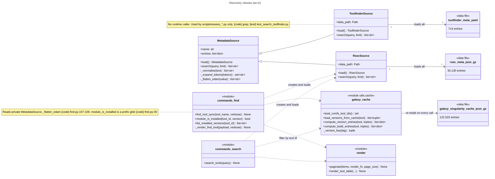

---

## 2. Package and dependency diagram (as-is)

Internal imports only, from an AST scan that resolves relative imports and includes
imports inside functions. Dashed edges are function-local imports. Edges marked ⚠ break
the intended layering (client → commands → builder/search → utils) or form a cycle.

```mermaid
---
title: Package dependencies (as-is)
---
flowchart TD
    init["shelley/__init__<br/>__version__, eager re-exports"]
    cli["client.cli"]
    subgraph commands
        c_build["build"]
        c_clean["clean"]
        c_find["find"]
        c_search["search"]
        c_inter["interactive"]
        c_update["update"]
    end
    builder["builder<br/>cvmfs_builder, guts_integration, shpc_settings"]
    search["search<br/>base, rsec, toolfinder"]
    style["utils.style<br/>console, ShelleyStyle"]
    uc["utils.update_check"]
    batch["utils.batch"]
    core["utils core<br/>globals, perms, modules, cache, render, args, commands"]
    scripts["scripts<br/>build_galaxy_cache, build_rsec_meta"]

    init --> builder
    init --> cli
    cli --> c_build & c_clean & c_find & c_search & c_inter
    cli -.-> c_update
    cli --> batch
    c_inter --> c_build & c_clean & c_find & c_search
    c_clean -->|"⚠ command→command"| c_build
    c_clean -->|"⚠ command→command"| c_find
    batch -->|"⚠ utils→commands"| c_build
    c_build --> builder
    c_clean --> builder
    c_find --> search
    c_search --> search
    builder -->|"⚠ builder→presentation"| style
    style -.->|"⚠ cycle via init"| uc
    uc -->|"⚠ imports package root"| init
    c_update -.-> init
    scripts --> core
    builder --> core
    commands --> core
    commands --> style
    %% [code] AST scan: tmp/design/pyreverse/imports_ast.txt
    %% builder->style: cvmfs_builder.py:25 imports console, ShelleyStyle from shelley.utils
    %% uc->init: update_check imports shelley.__version__; shelley/__init__.py:17-18 eagerly imports builder and client
```

| Finding | Evidence |
|---|---|
| Import cycle: `shelley/__init__` → `client.cli` → `utils.style` ⇢ `utils.update_check` → `shelley`. It works only because the `style` → `update_check` import is inside a function | `[code]` [`__init__.py:17-18`](../../../shelley/__init__.py#L17-L18), [style.py:505](../../../shelley/utils/style.py#L505) |
| `import shelley` loads the builder, the CLI and every command, because `__init__` re-exports `CVMFSModuleBuilder` and `cli_main` | `[code]` [`__init__.py:17-20`](../../../shelley/__init__.py#L17-L20) |
| Layering inversion: `utils.batch` imports `commands.build` | `[code]` [batch.py:8](../../../shelley/utils/batch.py#L8) |
| Command-to-command coupling: `clean` imports `needs_sudo`, `reexec_command` and `sudo_env_args` from `build`, and `list_installed_versions` from `find` | `[code]` [clean.py:9-10](../../../shelley/commands/clean.py#L9-L10) |
| The builder layer imports the presentation layer (`console`, `ShelleyStyle`) and prints panels mid-build | `[code]` [cvmfs_builder.py:25](../../../shelley/builder/cvmfs_builder.py#L25), [:544-550](../../../shelley/builder/cvmfs_builder.py#L544-L550), [:580-588](../../../shelley/builder/cvmfs_builder.py#L580-L588) |
| Highest fan-in: `utils.globals` and `utils.style` (11 importers each) | `[code]` AST scan |
| Highest fan-out: `client.cli` (10), `commands.interactive` (7) | `[code]` AST scan |
| Largest modules: `cvmfs_builder.py` 869 lines; `style.py` 517; `build_rsec_meta.py` 362 | `[code]` `wc -l` |
| CLI and REPL dispatch are two separate `if`/`elif` chains over the same commands; the shared `CORE_COMMANDS` table holds help text only and omits `clean` | `[code]` [cli.py:64-145](../../../shelley/client/cli.py#L64-L145), [interactive.py:46-75](../../../shelley/commands/interactive.py#L46-L75), [commands.py:9-25](../../../shelley/utils/commands.py#L9-L25) |

---

## 3. Component and deployment diagram (as-is)

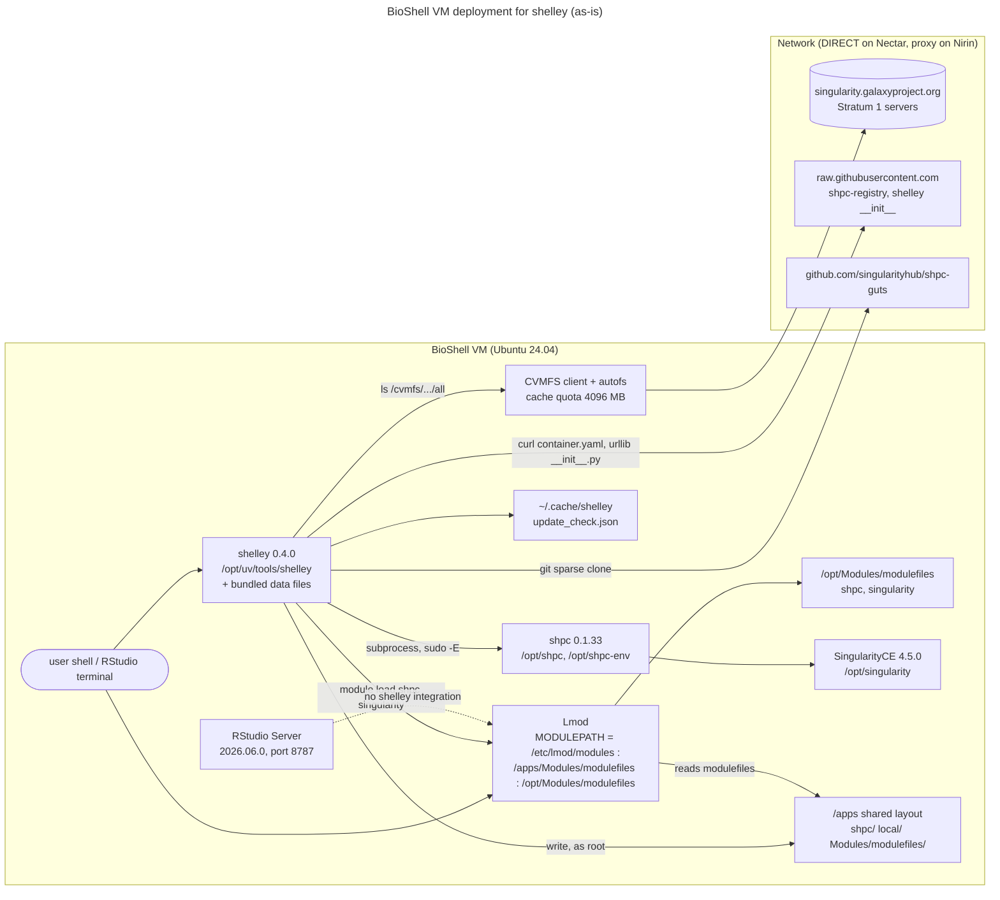

What creates each element:

| Element | Path | Created by | Evidence |
|---|---|---|---|
| Lmod and `MODULEPATH` | `/etc/lmod/modulespath` | Ansible `common` (comments out defaults, adds `/apps/Modules/modulefiles`, `/opt/Modules/modulefiles`) | `[code]` BioShell `roles/common/tasks/main.yml:118-133`; `[runtime]` |
| BioShell modulefiles (R, rstudio, jupyter, …) | `/apps/Modules/modulefiles/<tool>/<ver>` | Ansible `common`, `rstudio`, `nextflow`, `globus_connect_personal` | `[code]` `roles/common/tasks/main.yml:135-165`, `roles/rstudio/tasks/main.yml:36` |
| SingularityCE, `singularity` modulefile, auto-load | `/opt/singularity/4.5.0`, `/opt/Modules/modulefiles/singularity` | Ansible `singularity` | `[code]` `roles/singularity/tasks/main.yml:47-106` |
| shpc, its central settings ($HOME bases), a patched `singularity.lua` module template, `shpc` modulefile | `/opt/shpc`, `/opt/shpc-env`, `/opt/Modules/modulefiles/shpc` | Ansible `singularity` | `[code]` `roles/singularity/tasks/main.yml:108-165` |
| CVMFS client, `default.local`, Galaxy keys, autofs | `/etc/cvmfs/*`, `/cvmfs` | Ansible `cvmfs`; the cache is wiped by `cleanup` | `[code]` `roles/cvmfs/tasks/main.yml`, `roles/cleanup/tasks/main.yml:34` |
| uv and shelley | `/opt/uv`, `/opt/uv/tools/shelley`, `/usr/local/bin/shelley` | Ansible `shelley`; smoke-tested by `validate_shelley` (`--help`, `--version`) | `[code]` `roles/shelley/tasks/main.yml:11-46`, `roles/validate_shelley/tasks/main.yml:14-25` |
| Shared build layout and shpc settings | `/apps/shpc/{modules,containers,wrappers,views,settings.yml}`, `/apps/local` | shelley, on the first `build` (not Ansible) | `[code]` [perms.py:163-171](../../../shelley/utils/perms.py#L163-L171), [shpc_settings.py:87-123](../../../shelley/builder/shpc_settings.py#L87-L123) |
| Lmod modulefile symlinks for built tools | `/apps/Modules/modulefiles/<tool>/<tag>.lua` | shelley `build` | `[code]` [cvmfs_builder.py:572-578](../../../shelley/builder/cvmfs_builder.py#L572-L578) |
| Update-check cache | `~/.cache/shelley/update_check.json` | shelley, per user | `[code]` [update_check.py:49-52](../../../shelley/utils/update_check.py#L49-L52) |
| RStudio Server | system package, autostart disabled | Ansible `rstudio` | `[code]` `roles/rstudio/tasks/main.yml:2-36` |

---

## 4. Sequence diagrams (as-is)

### 4.1 `shelley search <description>`

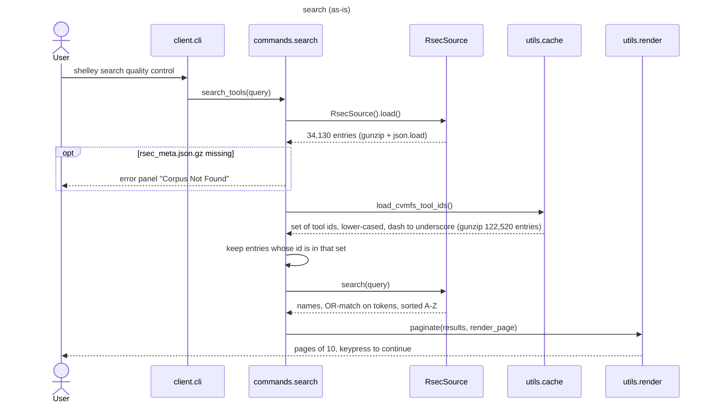

### 4.2 `shelley find <tool> [-v]`

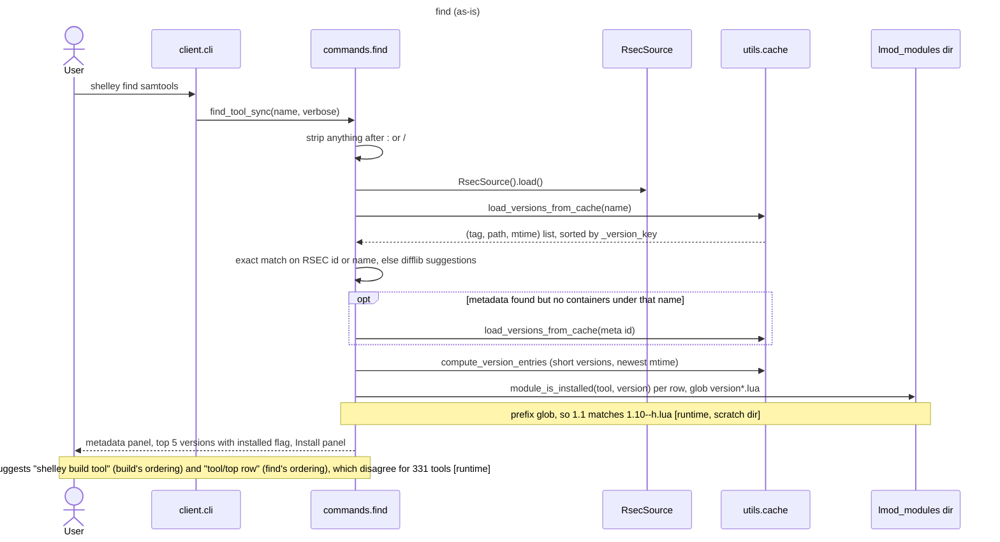

### 4.3 `shelley build <tool[/version]> [-i]`: dispatch, elevation and bootstrap

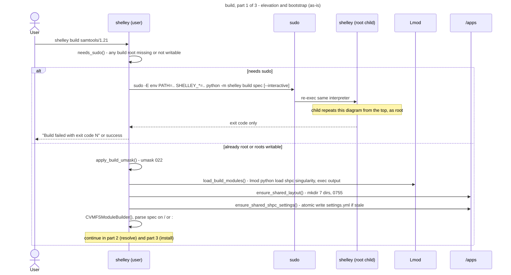

### 4.4 `build`, part 2: version resolution

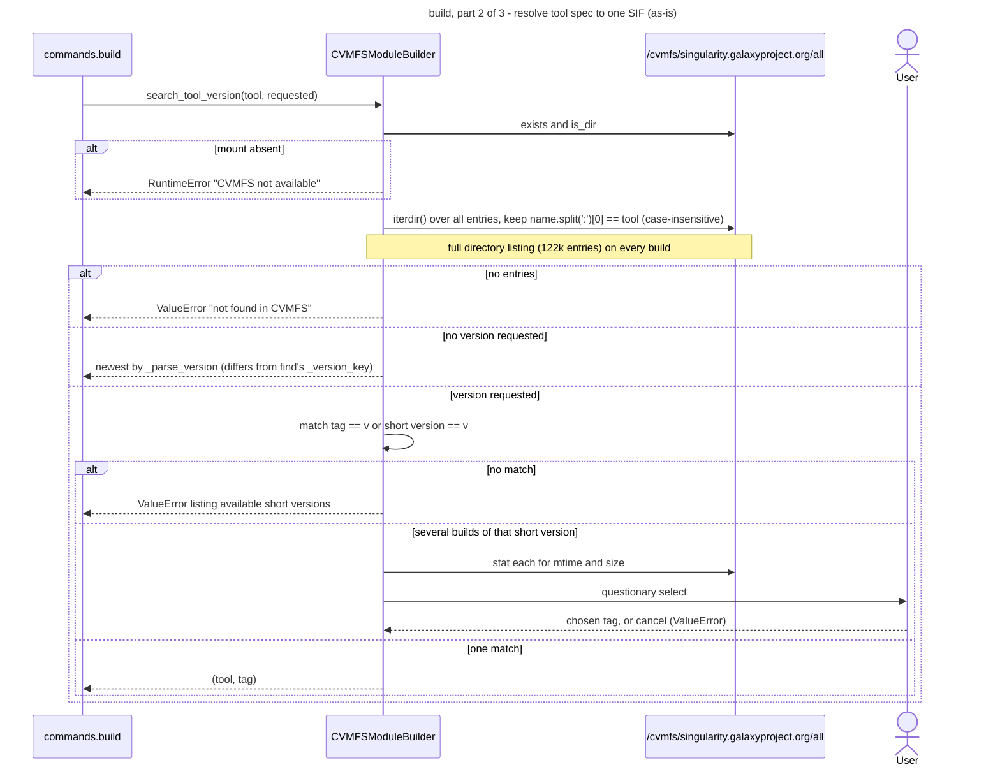

### 4.5 `build`, part 3: install, share and link

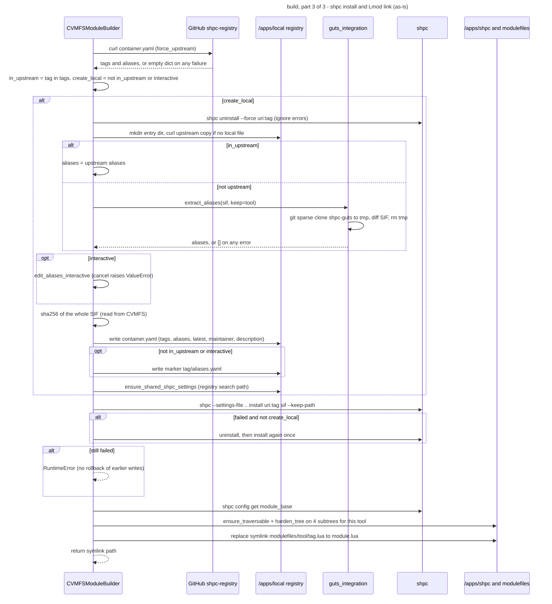

### 4.6 `shelley build <tools-file>` (batch)

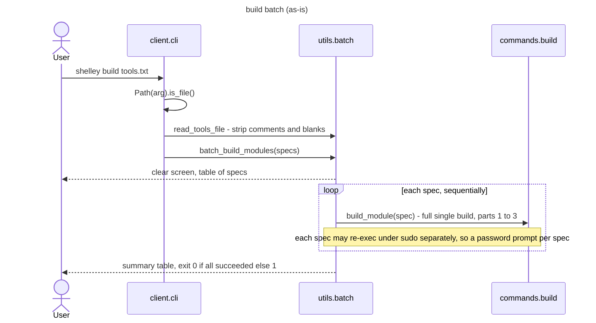

### 4.7 `shelley clean <tool>:<tag> [-y]`

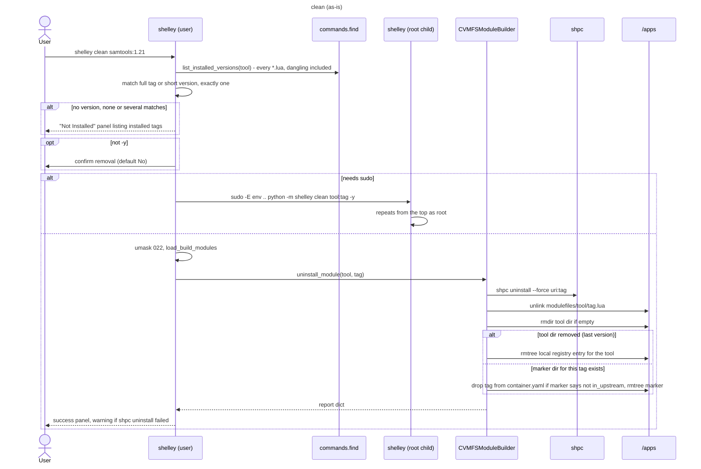

### 4.8 `shelley update` and the update notice

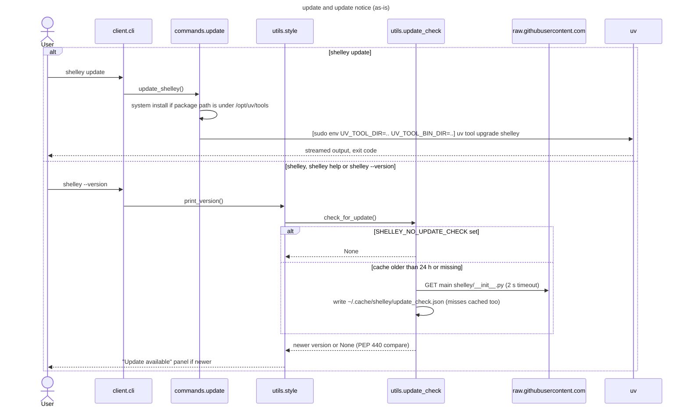

---

## 5. Artefact lifecycle state diagram (as-is)

The lifecycle of one Galaxy `(tool, tag)` on one VM. No code models these states
explicitly; they are inferred from which files exist. Transitions marked **BUG** are
where known or newly found defects live.

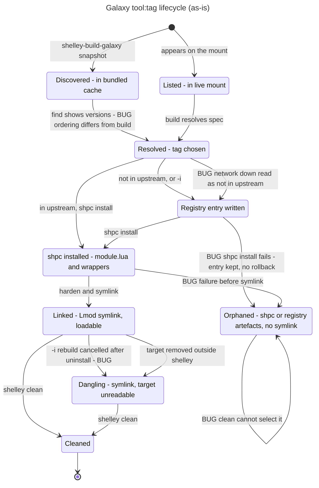

Evidence for each transition marked BUG:

| Transition | Defect | Evidence |
|---|---|---|
| Cached → Resolved | `find` orders versions with `_version_key`; `build` uses `_parse_version`. 331 of 13,183 tools get a different "latest". This is the known silent wrong-version match | `[code]` [cache.py:16-21](../../../shelley/utils/cache.py#L16-L21), [cvmfs_builder.py:165-193](../../../shelley/builder/cvmfs_builder.py#L165-L193); `[runtime]` |
| (find display) | `module_is_installed` matches `version*.lua`, so `1.1` reads as installed when only `1.10--…` is | `[code]` [find.py:30](../../../shelley/commands/find.py#L30); `[runtime]` scratch-dir check |
| RegEntry → Orphan | The registry entry, marker and settings are written before `shpc install`; a failed install raises without undoing them | `[code]` [cvmfs_builder.py:531-562](../../../shelley/builder/cvmfs_builder.py#L531-L562) |
| ShpcInst → Orphan | Any exception after `shpc install` succeeds and before the symlink is made leaves an unloadable shpc module | `[code]` [cvmfs_builder.py:564-578](../../../shelley/builder/cvmfs_builder.py#L564-L578); `[runtime]` 9 orphaned `module.lua` on the dev VM (testing leftovers, see `tmp/design/watchlist.md`) |
| Linked → Dangling | On the `create_local` path, `shpc uninstall` of the existing tag runs before the alias prompt; cancelling the prompt raises, leaving the symlink pointing at a removed `module.lua`, no wrappers, and an upstream copy of `container.yaml` in the local registry | `[code]` [cvmfs_builder.py:531-541](../../../shelley/builder/cvmfs_builder.py#L531-L541), [guts_integration.py:172-173](../../../shelley/builder/guts_integration.py#L172-L173); `[runtime]` reproduced with `seqtk:r93--0` in scratch build roots, 2026-10-07 |
| Resolved → RegEntry (offline) | With no network, the upstream lookup returns `{}`, so an upstream tag is treated as absent; alias discovery also fails. The build succeeds, says the tag "is not in the upstream shpc-registry", and writes a local entry with no aliases. That entry shadows upstream on later online rebuilds until `clean` | `[code]` [cvmfs_builder.py:93-97](../../../shelley/builder/cvmfs_builder.py#L93-L97), [:521-528](../../../shelley/builder/cvmfs_builder.py#L521-L528), [guts_integration.py:118-119](../../../shelley/builder/guts_integration.py#L118-L119); `[runtime]` reproduced, all HTTP(S) routed to a dead proxy |
| Orphan → Orphan | `clean` resolves only tags with an Lmod symlink, so orphans cannot be targeted | `[code]` [clean.py:27-50](../../../shelley/commands/clean.py#L27-L50) |

---

## 6. Responsibility table (as-is)

| Module / class | Knows | Does | Collaborates with | Evidence | Smells observed |
|---|---|---|---|---|---|
| `client.cli` | argv shape for every command | Dispatches commands, parses flags, detects a batch file, prints usage | every command, `batch`, `args`, `style` | `[code]` [cli.py](../../../shelley/client/cli.py); `[test]` test_batch_command, test_clean_command | Dispatch duplicated with `interactive`; the file's own TODO says helpers accumulate here ([cli.py:3-6](../../../shelley/client/cli.py#L3-L6)) |
| `commands.interactive` | REPL commands | Reads lines, dispatches to the same command functions | build, clean, find, search, `args` | `[code]`; `[test]` test_interactive | Second copy of the dispatch; help table omits `clean` |
| `commands.build` | sudo policy, re-exec argv, build roots | Elevates, bootstraps the layout, parses the spec, drives the builder, renders the result | `CVMFSModuleBuilder`, `perms`, `shpc_settings`, `modules`, `style` | `[code]` [build.py](../../../shelley/commands/build.py); `[test]` test_shared_build, test_resolve_executable | Hosts the shared elevation helpers that `clean` imports; dead `list_cvmfs_versions` |
| `commands.clean` | installed tags (via `find`) | Resolves a tag, confirms, elevates, calls `uninstall_module`, renders the report | `commands.build`, `commands.find`, `CVMFSModuleBuilder` | `[code]` [clean.py](../../../shelley/commands/clean.py); `[test]` test_clean_command | Spec parsing duplicated from `build` |
| `commands.find` | RSEC record shape, cache tuple shape, modulefile naming | Exact or fuzzy lookup, version table, installed flags, rendering | `RsecSource`, `utils.cache`, `render`, `style`, `globals` | `[code]` [find.py](../../../shelley/commands/find.py); `[test]` test_find_install_panel, test_verbosity | Calls private `_flatten_edam`; installed check also used by `clean`; prefix-glob bug |
| `commands.search` | Galaxy id normalisation | Loads RSEC, filters by Galaxy cache, searches, paginates | `RsecSource`, `utils.cache`, `render` | `[code]` [search.py](../../../shelley/commands/search.py) | No direct test |
| `commands.update` | uv install layouts | Picks the upgrade argv and runs it | `uv`, `style` | `[code]`; `[test]` test_update | — |
| `CVMFSModuleBuilder` | Galaxy mount layout, tag grammar, version ordering, shpc URIs, registry YAML schema, marker format, permission subtrees, Lmod symlink layout | Lists versions, resolves, prompts, hashes SIFs, writes registry entries, runs shpc, hardens, links, uninstalls | registry functions, `guts_integration`, `shpc_settings`, `perms`, `globals`, `style`, `questionary`, `subprocess` | `[code]` [cvmfs_builder.py:136-869](../../../shelley/builder/cvmfs_builder.py#L136-L869); `[test]` test_cvmfs_builder, test_registry, test_shared_build | 734-line class with at least 5 reasons to change; mixes I/O, prompts and rendering with logic; supplier-specific throughout |
| registry functions | upstream URL, `container.yaml` schema | Fetches and caches registry entries; builds shpc argv | `curl`, `shpc`, `perms` | `[code]` [cvmfs_builder.py:42-133](../../../shelley/builder/cvmfs_builder.py#L42-L133); `[test]` test_registry `get_registry_tags`, the read-path writer to `/apps/local`, has no runtime caller (tests only) |
| `guts_integration` | shpc-guts URL, base images, alias shape | Diffs a SIF for aliases; interactive alias editing | `container_guts`, `git`, `questionary` | `[code]`; `[test]` test_select_aliases | Swallows every exception, including `SystemExit`, returning `[]` |
| `shpc_settings` | shpc settings semantics | Writes the override settings file atomically | `globals` | `[code]`; `[test]` test_shpc_settings | — |
| `utils.perms` | shared permission model | umask, mkdir, chmod walks bounded to build roots | `globals` | `[code]`; `[test]` test_perms | — |
| `utils.globals` | every path and mode default | Resolves overridable paths per call | — | `[code]` | Named "globals" but holds Galaxy and shpc-specific constants |
| `utils.modules` | Lmod driver | Loads build modules into `os.environ` once per process | `lmod`, `style` | `[code]`; `[test]` test_modules | Module-level `_LOADED` flag; `exec` of Lmod output |
| `utils.cache` | Galaxy cache schema, tag grammar | Loads and shapes version rows | gzip JSON file | `[code]`; `[test]` test_verbosity | Re-reads and re-parses the 122k-entry file on every call; second version-ordering rule |
| `MetadataSource` / `RsecSource` / `ToolfinderSource` | corpus shapes, tokenisation, stop words | Load a corpus; keyword OR-search | data files | `[code]` [search/](../../../shelley/search/); `[test]` test_search_base, test_search_rsec, test_search_toolfinder | `search()` duplicated verbatim in both subclasses; `ToolfinderSource` unused at runtime |
| `utils.style` / `ShelleyStyle` | theme, banner, panel layouts | Builds rich renderables; owns the global `console`; triggers the update check | `rich`, `update_check` | `[code]` [style.py](../../../shelley/utils/style.py); `[test]` test_rendering, test_interactive_rendering | Class of 17 static methods; presentation module triggers network I/O |
| `utils.render` | pagination | Paginates and renders tool tables | `style` | `[code]`; `[test]` test_cli_paginate | — |
| `utils.batch` | tools-file format | Reads specs; runs builds in sequence; renders summary | `commands.build`, `style` | `[code]`; `[test]` test_batch_file_build | Lives in `utils` but depends on a command |
| `utils.args`, `utils.commands` | flag syntax, help text | Split flags from positionals; shared help rows | — | `[code]`; `[test]` test_verbosity, test_interactive | — |
| `utils.update_check` | release-check URL, cache file | Daily cached version check | `urllib`, `shelley.__version__` | `[code]`; `[test]` test_update_check | Imports the package root (cycle) |
| `scripts.build_galaxy_cache`, `scripts.build_rsec_meta` | mount layout, RSEC repo layout | Regenerate the bundled data files (CI, monthly) | filesystem, git | `[code]` | No tests (data refresh is out of scope for this review) |

---

## 7. Hard-coded Galaxy and shpc assumptions (as-is)

Every place where the design assumes "supplier = Galaxy SIFs, made loadable by shpc".

| # | Assumption | Where |
|---|---|---|
| 1 | The only software location is `/cvmfs/singularity.galaxyproject.org/all` | `[code]` [globals.py:16](../../../shelley/utils/globals.py#L16), [:61-63](../../../shelley/utils/globals.py#L61-L63); default argument bound at import, [cvmfs_builder.py:141](../../../shelley/builder/cvmfs_builder.py#L141); [build_galaxy_cache.py:35-36](../../../shelley/scripts/build_galaxy_cache.py#L35-L36); [conftest.py:6](../../../tests/conftest.py#L6) |
| 2 | A tool is a flat file named `tool:tag` in one directory | `[code]` [cvmfs_builder.py:210-217](../../../shelley/builder/cvmfs_builder.py#L210-L217), [:514](../../../shelley/builder/cvmfs_builder.py#L514), [:753](../../../shelley/builder/cvmfs_builder.py#L753), [:845](../../../shelley/builder/cvmfs_builder.py#L845); [build_galaxy_cache.py:77-80](../../../shelley/scripts/build_galaxy_cache.py#L77-L80) |
| 3 | Tags follow Bioconda `version--build`; the short version is everything before `--` | `[code]` [cvmfs_builder.py:176](../../../shelley/builder/cvmfs_builder.py#L176), [:828](../../../shelley/builder/cvmfs_builder.py#L828), [:833](../../../shelley/builder/cvmfs_builder.py#L833); [cache.py:68](../../../shelley/utils/cache.py#L68); [clean.py:39](../../../shelley/commands/clean.py#L39); [find.py:232](../../../shelley/commands/find.py#L232) |
| 4 | Every tool's container URI is `quay.io/biocontainers/<tool>` | `[code]` [cvmfs_builder.py:39](../../../shelley/builder/cvmfs_builder.py#L39), [:130](../../../shelley/builder/cvmfs_builder.py#L130), [:512](../../../shelley/builder/cvmfs_builder.py#L512), [:640](../../../shelley/builder/cvmfs_builder.py#L640) |
| 5 | Making software loadable means `shpc install --keep-path` plus a symlink | `[code]` [cvmfs_builder.py:263-284](../../../shelley/builder/cvmfs_builder.py#L263-L284), [:572-578](../../../shelley/builder/cvmfs_builder.py#L572-L578) |
| 6 | The upstream metadata for a container is the singularityhub shpc-registry on GitHub | `[code]` [globals.py:23](../../../shelley/utils/globals.py#L23); [cvmfs_builder.py:86](../../../shelley/builder/cvmfs_builder.py#L86), [:346](../../../shelley/builder/cvmfs_builder.py#L346) |
| 7 | Commands come from a guts diff of the SIF against Docker base images | `[code]` [guts_integration.py:50-61](../../../shelley/builder/guts_integration.py#L50-L61), [:105](../../../shelley/builder/guts_integration.py#L105) |
| 8 | Building needs root, `shpc` and `singularity` | `[code]` [globals.py:27](../../../shelley/utils/globals.py#L27); [build.py:93-136](../../../shelley/commands/build.py#L93-L136) |
| 9 | One modulefile per `tool/tag.lua` under one Lmod directory; "installed" = that symlink | `[code]` [find.py:21-43](../../../shelley/commands/find.py#L21-L43); [cvmfs_builder.py:573-574](../../../shelley/builder/cvmfs_builder.py#L573-L574) |
| 10 | The version list for `find` comes from a bundled snapshot of the Galaxy mount | `[code]` [cache.py:26](../../../shelley/utils/cache.py#L26), [:39](../../../shelley/utils/cache.py#L39) |
| 11 | `search` only returns tools present in the Galaxy cache, joined on bio.tools `id` | `[code]` [search.py:24-30](../../../shelley/commands/search.py#L24-L30) |
| 12 | User messages name Galaxy CVMFS and Singularity | `[code]` [build.py:218](../../../shelley/commands/build.py#L218), [:234](../../../shelley/commands/build.py#L234); [find.py:296](../../../shelley/commands/find.py#L296); [cvmfs_builder.py:815](../../../shelley/builder/cvmfs_builder.py#L815) |
| 13 | Permission hardening walks shpc's `quay.io/biocontainers/<tool>` subtrees | `[code]` [cvmfs_builder.py:478-483](../../../shelley/builder/cvmfs_builder.py#L478-L483); [perms.py:84](../../../shelley/utils/perms.py#L84) |
| 14 | The shpc module template is patched by the image (`moduleDir` without `realpath`) | `[code]` BioShell `roles/singularity/tasks/main.yml:148-153` |

---

## 8. Measurements (as-is)

| Measure | Value | Evidence |
|---|---|---|
| Runtime classes | 5 (`CVMFSModuleBuilder`, `MetadataSource`, `RsecSource`, `ToolfinderSource`, `ShelleyStyle`) | `[code]` |
| Package size | 35 modules, 5,112 lines | `[code]` |
| Tests | 299 collected; 273 run without CVMFS, network or shpc and pass in about 5 s; 25 marked `cvmfs`; 1 marked `shpc`; the `network` marker is declared but unused | `[test]` `pytest -m "not cvmfs and not network and not shpc"` on 2026-10-07 |
| Test isolation | Redirects the three build roots per test. Not redirected: the CVMFS path, `HOME`/`XDG_CACHE_HOME`, network calls | `[code]` [conftest.py:24-62](../../../tests/conftest.py#L24-L62) |
| Seam style | `monkeypatch.setattr` / `patch` of module attributes (about 190 call sites); no injected fakes | `[code]` grep of `tests/` |
| Modules with no direct test | `commands.search`, `utils.cache` (tested only via `test_verbosity`), `scripts/*` | `[code]` |
| Files holding Galaxy- or shpc-specific logic | 10 runtime modules: `cvmfs_builder`, `guts_integration`, `shpc_settings`, `globals`, `perms`, `cache`, `build`, `clean`, `find`, `search` | `[code]` section 7 |
