# Target-state architecture (to-be)

The agreed design for shelley's classes, modules, deployment and runtime flows. It is
drawn in the same style as [current-state.md](current-state.md) so the two can be read
side by side, and it uses the [glossary](glossary.md) terms. The design decisions and
their reasons are in the ADRs under [docs/explanation/decisions/](../../explanation/decisions/),
and the drivers each part serves are in [traceability.md](traceability.md#to-be).

- **Status:** agreed 2026-10-07 (design Option C; Option A is the recorded fallback).
  Once the migration is complete, this page replaces `current-state.md`.
- **Scope:** the Galaxy Singularity supplier and the metadata sources. A second supplier
  (EESSI, work in progress) plugs in as described in [§9](#9-adding-a-second-supplier-to-be).
- **Evidence:** this page describes a design, not observed behaviour. File and line
  references point to the as-is code a part replaces; `[code]` labels refer to external
  code (shpc) whose behaviour the design relies on.

Contents:

1. [Class diagrams](#1-class-diagrams-to-be)
2. [Package diagram and move map](#2-package-diagram-and-move-map-to-be)
3. [Component and deployment](#3-component-and-deployment-to-be)
4. [Sequence diagrams](#4-sequence-diagrams-to-be)
5. [Artefact lifecycle state diagram](#5-artefact-lifecycle-state-diagram-to-be)
6. [Responsibility table](#6-responsibility-table-to-be)
7. [Where Galaxy and shpc assumptions live](#7-where-galaxy-and-shpc-assumptions-live-to-be)
8. [Target measures](#8-target-measures-to-be)
9. [Adding a second supplier](#9-adding-a-second-supplier-to-be)

---

## 1. Class diagrams (to-be)

### 1a. Discovery: read-only, runs as the user

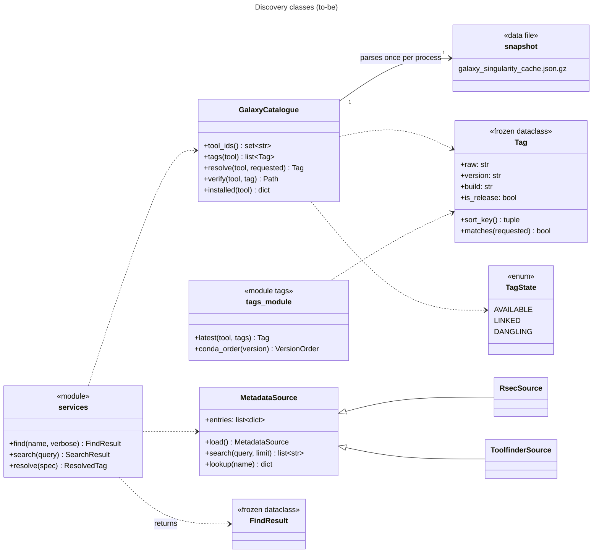

### 1b. Exposure: privileged and transactional, runs as root

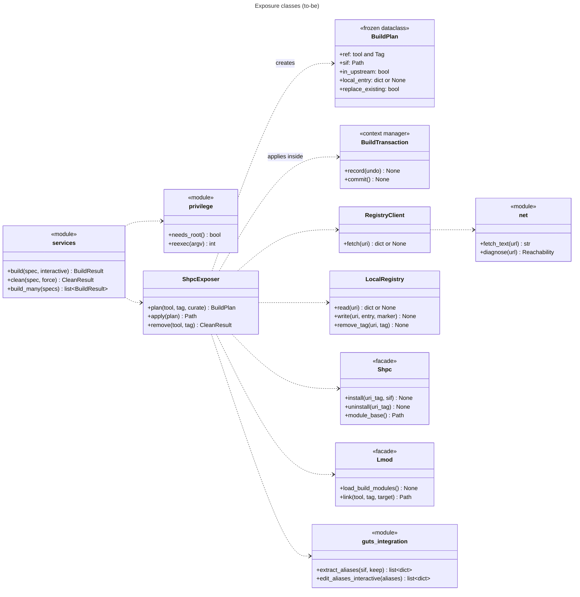

---

## 2. Package diagram and move map (to-be)

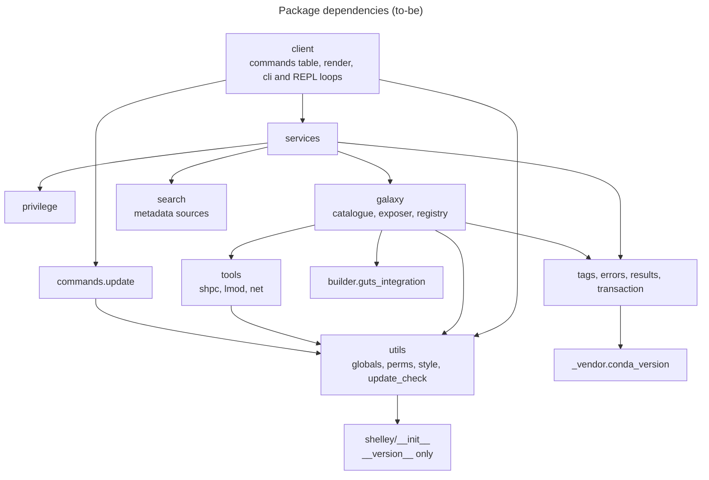

Layering rule: `client` → `services` → (`galaxy`, `search`, `privilege`) → (`core`, `tools`,
`builder`, `utils`). No module imports from a layer above it, and `shelley/__init__`
re-exports nothing but `__version__`. This removes the cycle and the three inversions
listed in [current-state §2](current-state.md#2-package-and-dependency-diagram-as-is).

| To-be module | Contents | Replaces (as-is) | Fowler refactoring |
|---|---|---|---|
| `shelley/tags.py` | `Tag`, `latest()`, `conda_order()` | `cache._version_key`; `CVMFSModuleBuilder._parse_version`, `_sort_versions`, `_get_latest_version`; every `split("--")` | Replace Primitive with Object; Combine Functions into Class |
| `shelley/_vendor/conda_version.py` | conda's `VersionOrder`, licence notice kept | — | — |
| `shelley/errors.py` | `NetworkUnavailable`, `MountUnavailable`, `TagNotFound`, `TagRequired`, `AmbiguousTag` | `RuntimeError`/`ValueError` messages matched by regex ([build.py:195](../../../shelley/commands/build.py#L195)) | Replace Error Code with Exception |
| `shelley/results.py` | `FindResult`, `SearchResult`, `BuildPlan`, `BuildResult`, `CleanResult`, `TagState` | payload and report dicts ([find.py:112-121](../../../shelley/commands/find.py#L112-L121), [cvmfs_builder.py:714-721](../../../shelley/builder/cvmfs_builder.py#L714-L721)) | Replace Record with Data Class |
| `shelley/transaction.py` | `BuildTransaction` | — | — |
| `shelley/galaxy/catalogue.py` | `GalaxyCatalogue` | [utils/cache.py](../../../shelley/utils/cache.py); [cvmfs_builder.py:158-238](../../../shelley/builder/cvmfs_builder.py#L158-L238), [:723-869](../../../shelley/builder/cvmfs_builder.py#L723-L869); [find.py:21-43](../../../shelley/commands/find.py#L21-L43) | Extract Class; Move Function |
| `shelley/galaxy/exposer.py` | `ShpcExposer` | [cvmfs_builder.py:240-721](../../../shelley/builder/cvmfs_builder.py#L240-L721) | Extract Class; Split Phase |
| `shelley/galaxy/registry.py` | `RegistryClient`, `LocalRegistry` | [cvmfs_builder.py:71-133](../../../shelley/builder/cvmfs_builder.py#L71-L133) | Move Function |
| `shelley/tools/shpc.py` | `Shpc` façade and the settings file | [cvmfs_builder.py:42-68](../../../shelley/builder/cvmfs_builder.py#L42-L68), [builder/shpc_settings.py](../../../shelley/builder/shpc_settings.py) | Move Function |
| `shelley/tools/lmod.py` | `Lmod` façade | [utils/modules.py](../../../shelley/utils/modules.py); [cvmfs_builder.py:572-578](../../../shelley/builder/cvmfs_builder.py#L572-L578) | Move Function |
| `shelley/tools/net.py` | `fetch_text`, `diagnose` | `curl` in [cvmfs_builder.py:86-92](../../../shelley/builder/cvmfs_builder.py#L86-L92), [:346-351](../../../shelley/builder/cvmfs_builder.py#L346-L351); `urlopen` in [update_check.py:82](../../../shelley/utils/update_check.py#L82) | Substitute Algorithm |
| `shelley/privilege.py` | `needs_root`, `reexec` | [build.py:25-82](../../../shelley/commands/build.py#L25-L82) | Move Function |
| `shelley/services.py` | `find`, `search`, `resolve`, `build`, `build_many`, `clean` | logic in [commands/](../../../shelley/commands/), [utils/batch.py](../../../shelley/utils/batch.py) | Split Phase |
| `shelley/client/commands.py` | `COMMANDS` table; CLI and REPL loops | [client/cli.py](../../../shelley/client/cli.py), [commands/interactive.py](../../../shelley/commands/interactive.py), [utils/args.py](../../../shelley/utils/args.py), [utils/commands.py](../../../shelley/utils/commands.py) | Replace Conditional with a dispatch table |
| `shelley/client/render.py` | Rendering of every result type | rendering in `commands/*.py`, [utils/render.py](../../../shelley/utils/render.py) | Move Function |
| `shelley/search/*` | `search()` and `lookup()` on the base class | itself | Pull Up Method |
| Kept as-is | `builder/guts_integration.py` (raises `NetworkUnavailable` on clone failure), `utils/globals.py` (Galaxy constants moved out), `utils/perms.py`, `utils/style.py`, `utils/update_check.py`, `commands/update.py` | — | Move Field (constants) |
| Removed | `CVMFSModuleBuilder`, `utils/cache.py`, `commands/{build,clean,find,search,interactive}.py`, `utils/batch.py`, `utils/modules.py`, `get_registry_tags`, `list_cvmfs_versions`, 4 unused `ShelleyStyle` methods | — | Remove Dead Code; Inline |

---

## 3. Component and deployment (to-be)

The deployment is unchanged from [current-state §3](current-state.md#3-component-and-deployment-diagram-as-is),
with these differences:

| Element | As-is | To-be |
|---|---|---|
| Upstream registry fetch | `curl` subprocess, failures read as "not upstream" | `urllib` via `tools/net.py`; failure raises `NetworkUnavailable` with a diagnosed reason |
| shpc-guts clone | `git` subprocess; failure → no aliases | unchanged command; failure raises `NetworkUnavailable` |
| `/apps/local` | upstream caches and shelley-authored entries | shelley-authored entries only; on each build of a tool that has one, the fresh upstream tags are merged in |
| Registry tag value | `sha256` of the whole SIF, read through the CVMFS cache | the fixed string `local:keep-path` (shpc accepts any string, `[code]` `shpc/main/schemas.py:13-18`) |
| Snapshot refresh | monthly CI | fortnightly CI |
| Mount access per build | full listing of `all/` (125k entries) | one `stat` of the chosen SIF; a full listing only when the requested tag is missing from the snapshot |

---

## 4. Sequence diagrams (to-be)

### 4.1 `shelley search <description>`

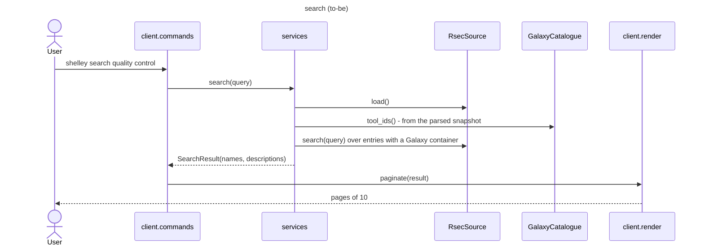

### 4.2 `shelley find <tool> [-v]`

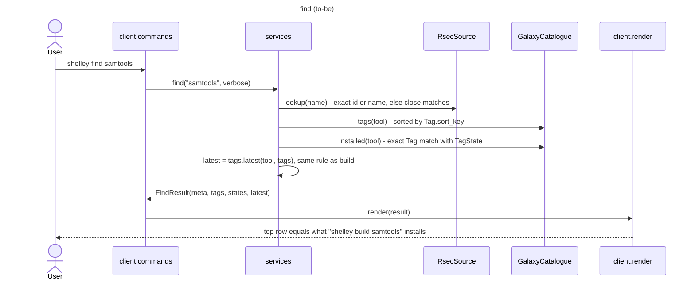

### 4.3 `build`, part 1: resolve as the user, then elevate

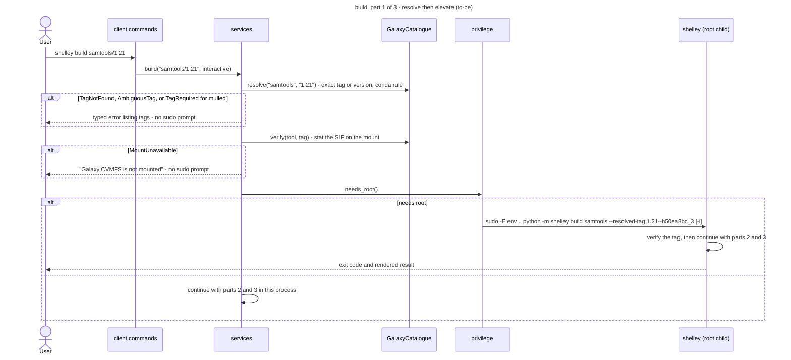

### 4.4 `build`, part 2: plan, with no writes

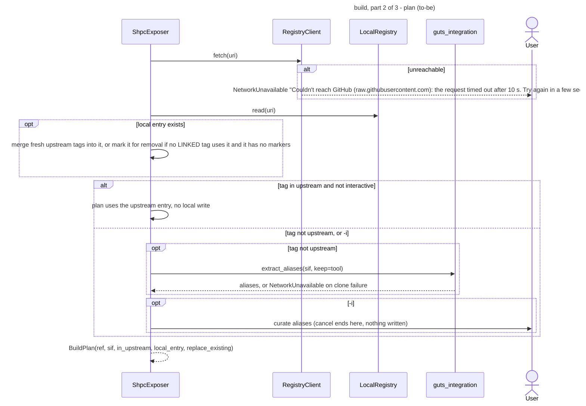

### 4.5 `build`, part 3: apply inside a transaction

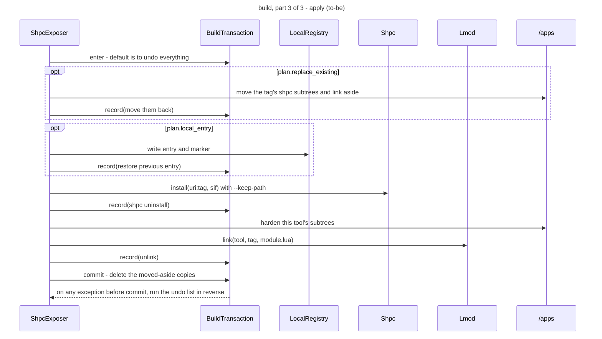

### 4.6 `shelley build <tools-file>` (batch)

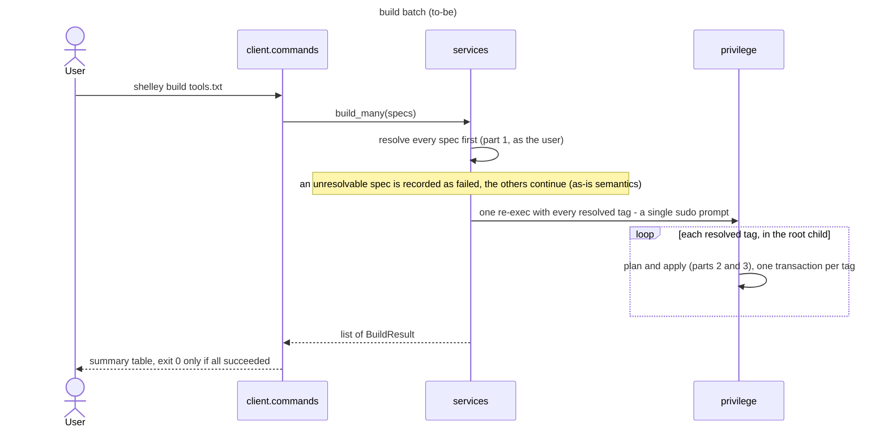

### 4.7 `shelley clean <tool>:<tag> [-y]`

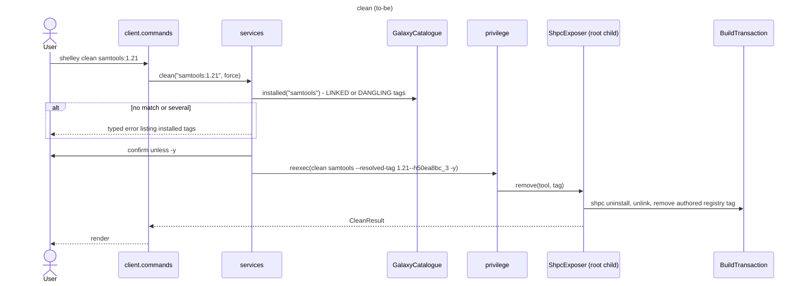

### 4.8 `shelley update` and the update notice

Unchanged from [current-state §4.8](current-state.md#48-shelley-update-and-the-update-notice),
except that the version fetch goes through `tools/net.py`.

---

## 5. Artefact lifecycle state diagram (to-be)

```mermaid
---
title: Galaxy tool:tag lifecycle (to-be)
---
stateDiagram-v2
    state "AVAILABLE - in snapshot, SIF verified on mount" as Available
    state "Planned - BuildPlan, nothing written" as Planned
    state "Applying - inside BuildTransaction" as Applying
    state "LINKED - loadable" as Linked
    state "DANGLING - link target removed outside shelley" as Dangling
    [*] --> Available
    Available --> Planned : plan - network, aliases, prompt
    Planned --> Available : NetworkUnavailable or cancel - no writes
    Planned --> Applying : apply
    Applying --> Linked : commit
    Applying --> Available : failure - undo; a replaced install is restored
    Linked --> Dangling : deleted outside shelley
    Linked --> Available : clean
    Dangling --> Available : clean
```

There is no orphaned state: every write happens inside `BuildTransaction`, and every
failure before `commit` is undone.

Legacy artefacts on VMs built with shelley ≤ 0.4.0 are handled as follows:
- A local entry that no `LINKED` tag uses and that has no marker is removed by the next
  build of that tool, inside its transaction.
- A local entry that is still in use gets the fresh upstream tags merged in.
- A module built while offline under T6 (no tool command) is fixed by
  `shelley clean <tool>:<tag>` followed by a rebuild.

---

## 6. Responsibility table (to-be)

| Module / class | Knows | Does | Collaborates with | Runs as |
|---|---|---|---|---|
| `client.commands` | argument syntax, help text, the hidden `--resolved-tag` flag | Parses, calls one service, renders; the CLI and the REPL loop over the same table | `services`, `client.render` | user |
| `client.render` | panel and table layouts | Renders result dataclasses | `utils.style` | user or root |
| `services` | use-case order | One function per use case; resolves before elevating; returns results | `GalaxyCatalogue`, `ShpcExposer`, `MetadataSource`, `privilege` | user (and root child) |
| `privilege` | sudo policy, re-exec argv | Decides on and performs the elevated re-exec | `sudo` | user |
| `GalaxyCatalogue` | snapshot schema, mount layout, `tool:tag` grammar, Lmod link layout | Lists, resolves, verifies and reports install state | `Tag`, snapshot, mount, Lmod directory | user |
| `Tag`, `tags.latest` | version grammar, conda ordering, non-version tags, mulled rule | Parses, orders, matches | vendored `VersionOrder` | either |
| `ShpcExposer` | shpc URI layout, registry entry schema, marker format, permission subtrees | Plans and applies builds; removes tags | `RegistryClient`, `LocalRegistry`, `guts_integration`, `Shpc`, `Lmod`, `BuildTransaction`, `perms` | root |
| `BuildTransaction` | undo actions recorded so far | Undoes in reverse unless committed | — | root |
| `RegistryClient` | upstream URL | Fetches an upstream entry, or `None` if not upstream | `net` | root |
| `LocalRegistry` | `/apps/local` layout, markers | Reads, writes, merges and removes authored entries | filesystem, `perms` | root |
| `Shpc`, `Lmod` | CLI argv, settings file, Lmod driver | Wrap one external tool each | `subprocess` | root |
| `net` | timeouts, error classification | Fetches; diagnoses failures in plain words | `urllib` | either |
| `MetadataSource` family | corpus formats, tokenisation | Loads, searches and looks up metadata | data files | user |
| `utils.globals`, `utils.perms` | shared layout and modes | Path resolution; permission hardening | — | either |
| `update`, `update_check` | uv layouts, release check | As-is | `net` | user |

---

## 7. Where Galaxy and shpc assumptions live (to-be)

The 14 assumptions in [current-state §7](current-state.md#7-hard-coded-galaxy-and-shpc-assumptions-as-is),
and where each one is held in the target design:

| # | Assumption | Held only in |
|---|---|---|
| 1 | Galaxy mount path | `galaxy/catalogue.py` (default from `utils.globals`) |
| 2 | Flat `tool:tag` files | `galaxy/catalogue.py` |
| 3 | `version--build` grammar | `tags.py` |
| 4 | `quay.io/biocontainers/<tool>` URI | `galaxy/exposer.py`, `galaxy/registry.py` |
| 5 | `shpc install --keep-path` plus a link | `galaxy/exposer.py`, `tools/shpc.py`, `tools/lmod.py` |
| 6 | Upstream shpc-registry on GitHub | `galaxy/registry.py` |
| 7 | Aliases from a guts diff | `builder/guts_integration.py` |
| 8 | Root, shpc and singularity for builds | `privilege.py`, `tools/` |
| 9 | One modulefile per `tool/tag.lua` | `galaxy/catalogue.py` (read), `tools/lmod.py` (write) |
| 10 | Versions from the bundled snapshot | `galaxy/catalogue.py` |
| 11 | `search` joined to Galaxy ids | `services.search` via `GalaxyCatalogue.tool_ids()` |
| 12 | User messages naming Galaxy | `client/render.py` |
| 13 | Hardening walks shpc subtrees | `galaxy/exposer.py` |
| 14 | Image-patched shpc module template | BioShell (unchanged) |

All shelley-side assumptions now sit in `galaxy/`, `tags.py`, `tools/`, `privilege.py`
and `client/render.py`. None remain in `services` or `client/commands.py`.

---

## 8. Target measures (to-be)

| Quality attribute (rank) | Target |
|---|---|
| Correctness (1) | `find`'s latest equals `build`'s default for every tool in the snapshot; no prefix matching anywhere |
| Shared-VM safety (2) | A failure injected at each `apply` step leaves `/apps` identical to before |
| Honest failures (3) | An offline build raises `NetworkUnavailable` before any write; `MountUnavailable` and resolution errors are reported before any sudo prompt |
| Testability (4) | Every service is testable with fakes for the catalogue, `Shpc`, `Lmod` and `RegistryClient`; no unmarked test touches `/apps`, `~`, the mount or the network |
| Operability (5) | No full-SIF read; no full mount listing on the default build path |
| Reviewability (6) | Delivered as moderate PRs, each reviewable in one sitting and named after Fowler refactorings |
| Extensibility (7) | A second supplier touches ≤ 3 modules (§9) |

---

## 9. Adding a second supplier (to-be)

A second supplier adds a catalogue class and an exposer class in its own package, plus a
name-to-pair lookup in `services`. When that second pair exists, a `typing.Protocol`
for each of the two roles is extracted from the two concrete classes. For EESSI (work
in progress), the exposer makes an existing module tree visible to Lmod and needs no
`BuildTransaction`. The open questions for that integration are tracked outside the
published docs.
