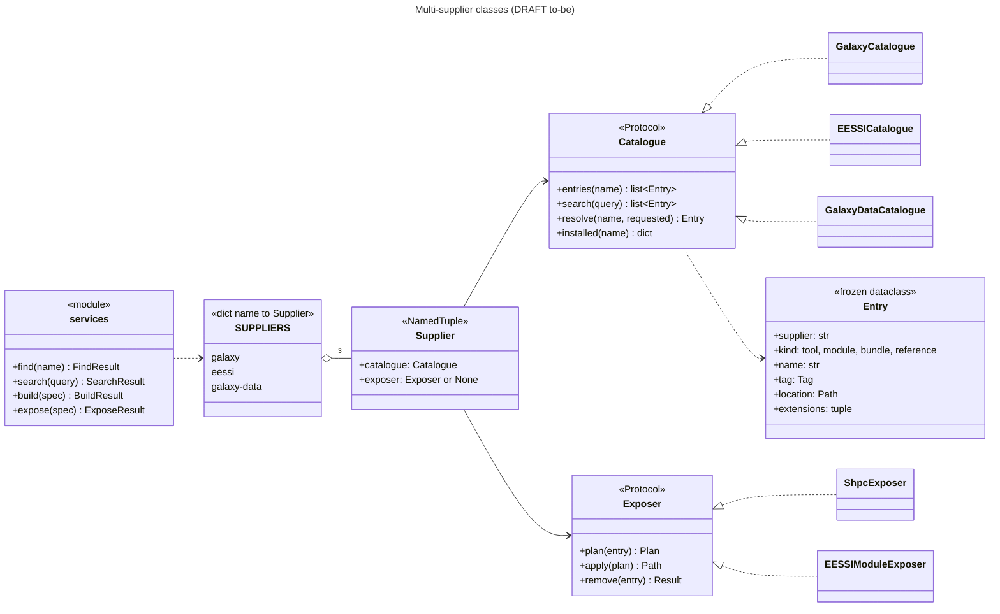
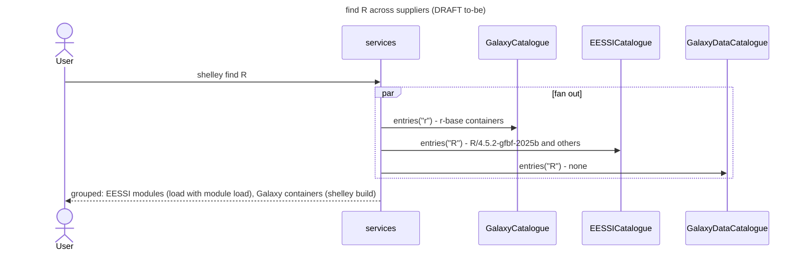
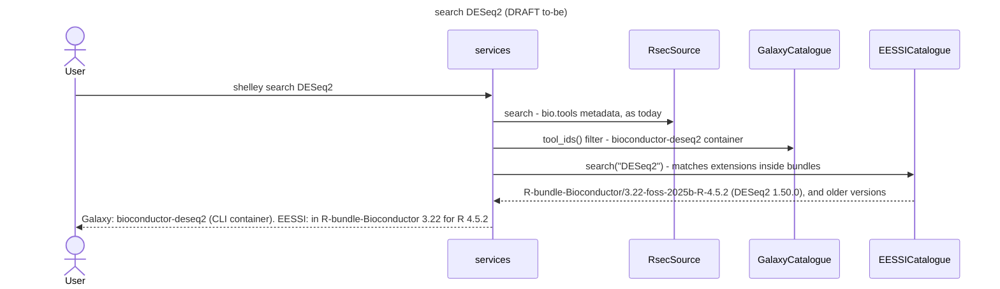

# DRAFT: multi-supplier to-be (Galaxy SIFs + EESSI + Galaxy reference data)

**Status: very draft (2026-10-07); Fred confirmed the level of detail. Set aside as latent work.** This extends the agreed single-supplier design ([target-state.md](../../docs/reference/architecture/target-state.md)) with the two latent suppliers, to show where they fit and what they would cost. It is **not** agreed, is not in the migration plan, and is not published.

- EESSI is work in progress (hand-configured on the dev VM).
- `data.galaxyproject.org` is latent (Fred, 2026-10-07).
- Evidence labels as in the glossary. `[runtime]` = observed on the dev VM today.

## 1. The three suppliers side by side

| | Galaxy Singularity (in production) | EESSI (work in progress) | Galaxy reference data (latent) |
|---|---|---|---|
| Mount | `/cvmfs/singularity.galaxyproject.org/all` | `/cvmfs/software.eessi.io/versions/<v>/software/linux/<cpu target>/modules/all` | `/cvmfs/data.galaxyproject.org/{byhand,managed}` |
| What a user gets | A CLI tool in a container | A module: compiler-optimised software, including **R plus package bundles** | A **path** to a genome, index or database |
| Catalogue source | Bundled snapshot plus a live check (ADR 0003) | Module tree: `<Name>/<version>-<toolchain>[-<suffix>].lua`; extensions in each `whatis` line `[runtime]` | 24 `.loc` manifests (tab-separated: key, build, name, path) and `builds.txt` (1,224 builds) `[runtime]` |
| Entry kinds | tool | module; **bundle** (a module whose purpose is its extensions) | reference (index, genome, database) |
| Version scheme | Bioconda tag, ordered by the conda rule (ADR 0002) | EasyBuild `version-toolchain-tcversion`; order by version (conda rule), then toolchain generation | None: keyed by genome build (`hg38`) and kind (`bwa_mem_index`) |
| Exposer | `ShpcExposer` (root, transaction) | **Open (E-Q1)**; see §5 | None (catalogue-only); optional later: a modulefile exporting paths |
| Privilege | root for `build` | depends on E-Q1 | none |

Evidence for the R-relevant rows `[runtime]`:

| EESSI version (zen2) | R | Bioconductor bundle | DESeq2 | Seurat |
|---|---|---|---|---|
| 2023.06 | 4.2.2, 4.3.2, 4.4.1 | 3.16 (R 4.2.2), 3.18 (R 4.3.2) | 1.38.3, 1.42.0 | 4.3.0, 5.0.1 |
| **2025.06** | 4.4.2, 4.5.1, **4.5.2** | 3.20 (R 4.4.2), **3.22 (R 4.5.2)** | 1.46.0, **1.50.0** | 5.1.0, **5.3.1** |
| 2026.06 | 4.6.1 | — | — | — |

**Implication for the R PoC:** `library(DESeq2); library(Seurat)` looks achievable today with `R-bundle-Bioconductor/3.22-foss-2025b-R-4.5.2`, but not yet on R 4.6. This is from module metadata only; it has not been run (see §8).

## 2. Class diagram (draft)

Three real catalogues now exist on paper, so this draft introduces a `typing.Protocol` per role. Per ADR 0001, the Protocols are extracted only when the second implementation is actually merged.

Design notes (draft):
- **Entry** generalises `Tag`. Each catalogue parses its own version scheme into an object with the same `sort_key`/`matches` interface. EESSI: `4.5.2-gfbf-2025b` gives version `4.5.2` and build `gfbf-2025b`. Data: the key is the build (`hg38`), and `sort_key` is alphabetical.
- **Bounded contexts** (Evans): Galaxy containers, EESSI modules and reference data stay three models. They meet only in `Entry`, which is just enough to list, find and route.
- **Composite** (Mak *(from memory)*): `services.find`/`search` fan out over `SUPPLIERS` and group results by supplier. With 3 children this is no longer the shallow one-child forwarding that round 1 rejected.

## 3. find across suppliers (draft)

**The same name in two suppliers:** `find` shows both groups. `shelley build <name>` keeps meaning Galaxy, so Galaxy delivery is unchanged (K1). EESSI is reached by its own verb (§5) or by an explicit `eessi:` prefix. Which verb is open (D-Q3).

## 4. search for a package across suppliers (F7, draft)

The EESSI extension index (names, versions and extensions for each module) would come from a **maintainer script**, `shelley-build-eessi`, producing a bundled snapshot like the Galaxy one. Walking and parsing hundreds of Lua files per EESSI version on every search would be slow. `[inferred]` Extension lists are assumed to be identical across CPU targets; this is unverified.

## 5. EESSI exposure: options (open, E-Q1)

| Option | How a user gets R 4.5.2 | Writes | Blast radius | Fits |
|---|---|---|---|---|
| **X1. Image-level:** BioShell adds the EESSI tree to `MODULEPATH` for everyone | `module load R-bundle-Bioconductor/3.22-foss-2025b-R-4.5.2` | nothing in shelley | **every image**; EESSI `R` conflicts with BioShell `R/4.3.3` for every user `[runtime]` (`conflict("R")`) | simplest; no shelley exposer at all |
| **X2. Thin wrapper modulefiles written by shelley** (draft favourite): `shelley expose r/4.5.2` writes `/apps/Modules/modulefiles/r/4.5.2.lua`, which loads the EESSI environment and then `R-bundle-Bioconductor/3.22-foss-2025b-R-4.5.2` | `module load r/4.5.2` (the requirements' lowercase naming) | one small file, inside the existing `BuildTransaction` | all users on that VM, opt-in per version | gives the PoC its `r/<ver>` names; sidesteps the `R` name clash unless `R/4.3.3` is also loaded |
| **X3. User-driven:** shelley prints instructions (`module load EESSI/2025.06`, then …) | two `module load`s | nothing | one user | no root needed; least integrated |

X2 also gives RStudio (requirements tension 2) a single module name to point `rsession` at, but the RStudio mechanism itself is out of scope here (E-Q4).

## 6. Reference data (draft)

- `GalaxyDataCatalogue` reads the `.loc` manifests live: there are 24 small files, so no snapshot is needed. Column layouts differ per manifest type (e.g. `bwa_mem_index.loc` puts the build in column 2 and the path in column 4), so a per-file schema table is needed.
- `shelley find hg38` would list the indices available for that build, with their paths. Managed `.loc` entries for `hg38` currently include 3 HISAT2 and 2 STAR indices; `byhand/hg38` holds more (e.g. `salmon_index`, `picard_index`) without `.loc` entries `[runtime]`.
- **No exposer.** The user needs a path, e.g. to pass `--bwa_index` to a Nextflow pipeline. A later option is a modulefile `ref/hg38` that exports variables such as `$BWA_MEM_INDEX`.

## 7. Cost against the target design

| Supplier | New modules | Changes to existing | Meets "≤ 3 modules" |
|---|---|---|---|
| EESSI | `eessi/catalogue.py`, `eessi/exposer.py` (X2), `scripts/build_eessi_index.py` | `SUPPLIERS` dict; Protocols extracted from Galaxy's concrete classes; render grouping | yes (3 new + small edits) |
| Galaxy data | `galaxy_data/catalogue.py` | `SUPPLIERS` dict; render | yes (1 new) |

## 8. Open questions for this draft (ranked by risk)

| # | Question | Resolution |
|---|---|---|
| D-Q1 | Does `module load R-bundle-Bioconductor/3.22-foss-2025b-R-4.5.2` followed by `R -e 'library(DESeq2); library(Seurat)'` actually work on a BioShell VM, and in RStudio? This is the PoC | **Spike**, on a non-shared VM if possible: it pulls GBs through a CVMFS cache already 3.6 / 4 GB full |
| D-Q2 | E-Q1: exposure option X1, X2 or X3? Who picks the EESSI version (2025.06 vs 2026.06)? | Decision for Fred, after D-Q1 |
| D-Q3 | The user-facing verb for EESSI: `shelley expose`, `shelley use`, or an `eessi:` prefix on `build`? | Decision for Fred; the glossary has "expose" internally |
| D-Q4 | Are extension lists identical across CPU targets, so that one index serves all VMs? | Doc check or a quick diff of two targets |
| D-Q5 | Is the CPU target stable when a training image moves between host types (E-Q3)? | Doc check (EESSI archdetect at load time suggests yes) |
| D-Q6 | Reference data: paths only, or `ref/<build>` modulefiles exporting variables? | Decision for Fred, when the data supplier is scheduled |
| D-Q7 | The requirements' PoC names `r/4.6.0`; EESSI has 4.6.1 with no Bioconductor bundle yet. | **Decided (Fred, 2026-10-07): keep it flexible.** The D-Q1 spike tries both paths: (a) R 4.5.2 with `R-bundle-Bioconductor/3.22`; (b) R 4.6.1 (2026.06), with DESeq2 and Seurat built from source against it, measuring build time and failure rate (requirements tension 7) |
