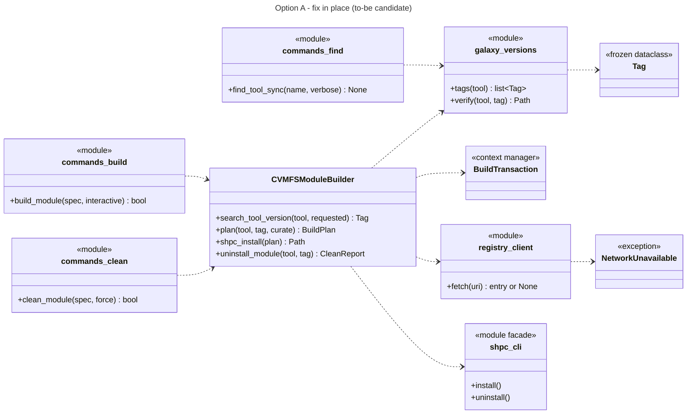
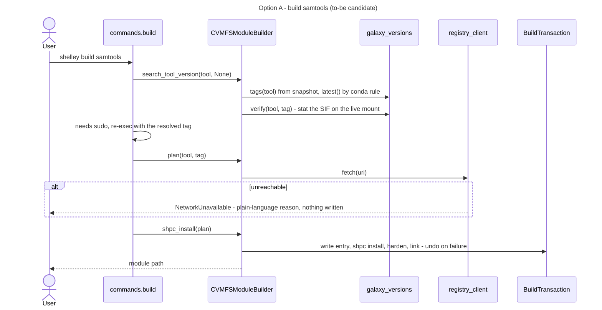
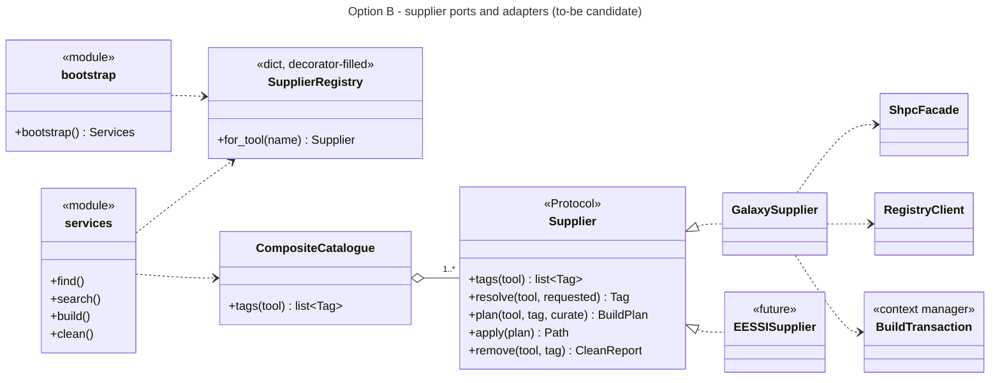
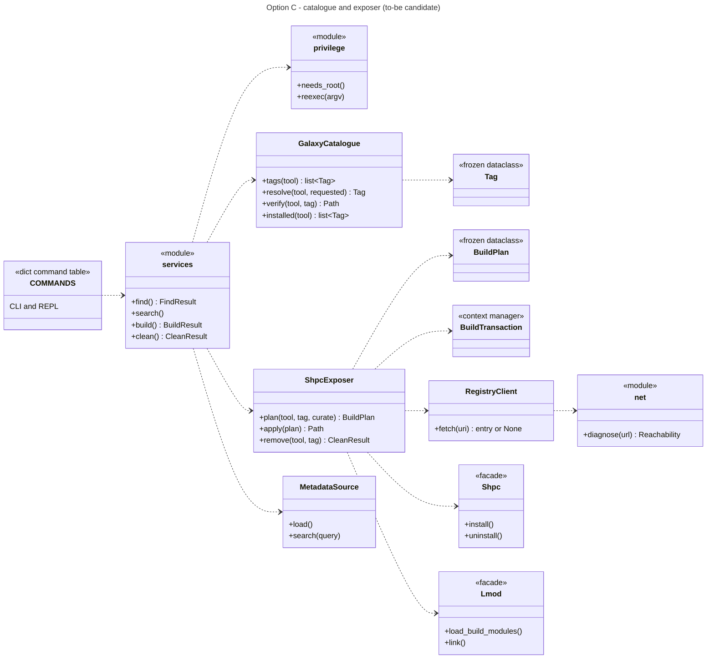
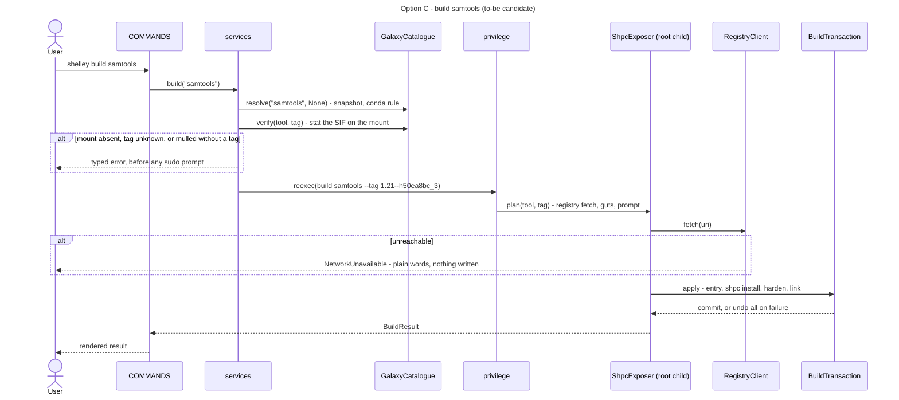

# Phase 5, round 1: design options (to-be candidates)

Working material. The agreed design will be written to `docs/reference/architecture/target-state.md`.

**Inputs:**
- the ranked quality attributes: 1 correctness, 2 shared-VM safety, 3 honest failures, 4 testability, 5 operability, 6 moderate reviewable PRs, 7 extensibility (deliberately last);
- the Phase 4 decisions: one source of versions (Q1), conda ordering (Q2), the mulled rule, fail fast offline (Q3);
- `docs/explanation/architecture-drivers.md`.

**Scope:** the Galaxy supplier and the metadata sources. EESSI appears only as a "what would this cost later" check.

---

## 0. Common core: in every option

Each of these passes the justification test whatever the overall structure, so the options differ only in where these pieces live and what wraps them.

| # | Element | Force (`[code]`/`[runtime]`) | Simplest Pythonic alternative | Why it falls short | Canon |
|---|---|---|---|---|---|
| K1 | **`Tag` value object**: a frozen dataclass with `version`, `build`, `is_release`, `sort_key` (conda rule, `v`-normalised), `matches(requested)`; plus `latest(tags)` with the mulled rule | `split("--")` in 5 places; two ordering rules (T1, 331 tools); prefix glob (T4) (`cache.py:16`, `cvmfs_builder.py:165`, `find.py:30`) | One shared `version_key(tag)` function | Covers ordering only. Equality (`1.0` = `v1.0`), matching a requested short version, and "is this a real version" would still be re-implemented on raw strings at each call site, which is how T1 and T4 arose | Replace Primitive with Object (Fowler); Fluent Python ch. 5 (data class builders) and ch. 11 (a Pythonic object) |
| K2 | **Gather, then commit**: every network call, prompt and lookup runs before the first write; the result is a frozen `BuildPlan` | T5 (destructive uninstall before the prompt) and T6 (network failure discovered mid-build), both `[runtime]` | Reorder lines inside `shpc_install` | Reordering fixes today's two cases but leaves nothing to stop the next helper from writing early; a plan object makes "no writes before apply" checkable in a test | Cosmic Python ch. 6: "only one code path that leads to changes: total success and an explicit commit"; Fluent Python ch. 5 |
| K3 | **`BuildTransaction`, a compensating Unit of Work**: a context manager that records an undo action for each artefact created and runs them in reverse unless `commit()` was called | T2 orphans (current-state §5), on the watch list | `try/except` cleanup in `shpc_install` | Four artefact kinds are created in three helpers; cleanup has to mirror creation order and stay in sync with it. `clean` needs the same knowledge | Cosmic Python ch. 6 (Unit of Work); Fluent Python ch. 18 (context managers). Caveat: a filesystem is not transactional, so this undoes changes rather than holding them back |
| K4 | **Failures as types**: `NetworkUnavailable(host, reason)` and `MountUnavailable` exceptions, raised before any write; "not upstream" is a normal `None` result | T6: `{}` means both "absent" and "unreachable" (`cvmfs_builder.py:93-97`) | Keep returning `{}`/`[]` | That is the bug | Rhodes, Sentinel Object (cites `str.index()` raising as "more rigorous"); Ousterhout ch. 10 |
| K5 | **Plain-language network diagnosis**: `net.diagnose(url) -> Reachability`, giving DNS failure, timeout, proxy refused or an HTTP error, as a sentence plus next steps | N1 and Fred's request for no raw `curl` output | A message suggesting `curl -sI` | Fred: not beginner-friendly | Mak, user expectations *(from memory)* |
| K6 | **One command table**: `COMMANDS: dict[str, Command]`, where each entry holds a parser, a handler and help text, shared by the CLI and the REPL | Repeated Switches (`cli.py:72-145`, `interactive.py:46-75`) | — (this is already the simplest form) | — | Fluent Python ch. 7 and 10 (functions as objects; Command as a plain function) |
| K7 | **No full-SIF hash**: the local registry tag value becomes a fixed marker, not `sha256(SIF)` | Reads up to 9.6 GB through a 4 GB cache; shpc ignores the value on `--keep-path` (`shpc/main/modules/module.py:99-109`) | Keep hashing | Rank 5 (operability); it buys nothing | — |
| K8 | **The local registry holds authored entries only**: no cache of upstream entries | Its dual role (`cvmfs_builder.py:101-111`) drives the 48-line `uninstall_module` docstring; fail-fast (Q3) removes the need for an offline cache | Keep the dual role | It keeps `clean`'s tag/marker bookkeeping, and the possibility of stale cached entries shadowing upstream | Ousterhout ch. 4–5 (pull complexity down; information hiding) |

Elements considered for the core and **rejected**:
- the **State pattern** for the lifecycle: no object changes behaviour by state. An `Enum` in `clean`'s report is enough.
- **Template Method** for the build steps: there is one implementation, and K2 and K3 already give the sequence its structure.

### Sketch K1: `Tag` (illustration only)

Before (four of the call sites):

```python
version_part = version_str.split("--")[0]                      # cvmfs_builder.py:176
short = tag.split("--")[0]                                     # cache.py:68
if ver == requested_version or ver.split("--", 1)[0] == requested_version   # cvmfs_builder.py:828
return any(p.is_file() for p in (lmod_modules() / tool_id).glob(f"{version}*.lua"))  # find.py:30
```

After:

```python
NON_VERSIONS = frozenset({"latest", "broken"})

@dataclass(frozen=True)
class Tag:
    raw: str                                     # "1.21--h50ea8bc_3"

    @property
    def version(self) -> str:                    # "1.21"; "v1.0" -> "1.0"
        return self.raw.split("--", 1)[0].removeprefix("v")

    @property
    def is_release(self) -> bool:
        return self.version not in NON_VERSIONS and not self.version.startswith("date.")

    def sort_key(self) -> tuple:
        return (self.is_release, conda_order(self.version), self.raw)

    def matches(self, requested: str) -> bool:   # exact tag or exact version, never a prefix
        return requested in (self.raw, self.version)

def latest(tool: str, tags: Iterable[Tag]) -> Tag:
    if tool.startswith("mulled-"):
        raise TagRequired(tool, sorted(t.raw for t in tags))
    return max(tags, key=Tag.sort_key)
```

### Sketch K2 + K3: plan, then apply in a transaction (illustration only)

Before (`cvmfs_builder.py:531-578`, condensed): writes and the prompt are interleaved, with no undo.

```python
self._shpc_uninstall(uri_tag)                          # destructive, first
aliases = self._ensure_local_registry_entry(...)       # curl, guts, PROMPT, write yaml
self._register_local_registry(...)
rc, out = self._run_shpc_install(uri_tag, sif)
if rc: raise RuntimeError(...)                         # entry and settings already written
self._share_build_artifacts(...)
dest.symlink_to(src)
```

After:

```python
plan = exposer.plan(tool, tag, curate=prompt_fn)       # network, guts, prompt: no writes
with BuildTransaction() as tx:                         # default: undo everything
    if plan.local_entry:
        registry.write(plan.local_entry); tx.record(lambda: registry.remove(plan.ref))
    shpc.install(plan.ref, plan.sif);     tx.record(lambda: shpc.uninstall(plan.ref))
    link = lmod.link(plan.ref);           tx.record(link.unlink)
    tx.commit()                                        # the only path that keeps changes
```

A rebuild of an installed tag runs `shpc.uninstall` inside the transaction, after the plan is complete, so cancelling the prompt (T5) can no longer delete anything. An undo for "restore the previous install" is an open question (round 2).

---

## Option A: fix in place

Keep `CVMFSModuleBuilder` as the single build class. Add the common core as helper modules beside it, and change the builder's internals to use them. `find`, `clean` and `search` call the same new helpers.



**CRC: `CVMFSModuleBuilder` (after A).** Responsibilities: resolve a tag; plan a build; apply it in a transaction; uninstall. Collaborators: `galaxy_versions`, `registry_client`, `shpc_cli`, `guts_integration`, `perms`, `BuildTransaction`. It still owns the shpc URI layout, alias policy and hardening.

**Sequence A: Galaxy, find a tool and make it loadable.**



**EESSI under A (work in progress):** a second builder-like class, plus `if supplier ==` branches in `find`, `build` and `clean`. A has no seam for it.

**Third-supplier cost:** about 6 modules (builder sibling, versions helper, `find`, `build`, `clean`, `search`). Shotgun Surgery drops from 10 modules to 6.

**Pattern justification:** K1–K8 only (passed above). No structural pattern is added.

**Assessment:** the smallest change set, and every Tier 0 is fixed. But the Large Class and its Divergent Change stay: every fix still lands in the same 700-line file, which makes PRs harder to review (rank 6).

---

## Option B: ports and adapters with a supplier Protocol

A `Supplier` Protocol (`tags`, `resolve`, `plan`, `apply`, `remove`), with a `GalaxySupplier` adapter. A `CompositeCatalogue` fans out across registered suppliers, and a `SupplierRegistry` (a decorator-filled dict) picks one per request. Service-layer functions receive suppliers and façades through a bootstrap module (Cosmic Python ch. 13).



**CRC: `GalaxySupplier`.** Responsibilities: list, resolve, plan, apply and remove Galaxy tags. Collaborators: `ShpcFacade`, `RegistryClient`, `BuildTransaction`, `Snapshot`.
**CRC: `SupplierRegistry`.** Responsibilities: map a request to a supplier. Collaborators: every `Supplier`.

**Sequence B: Galaxy.** Same as A from `plan` onward, preceded by `services.build` → `SupplierRegistry.for_tool("samtools")` → `GalaxySupplier`.
**Sequence B: EESSI (work in progress).** `SupplierRegistry.for_tool("R")` → `EESSISupplier.resolve` walks `modules/all/R/`; `plan` returns "expose only"; `apply` adds the module tree to `MODULEPATH` (E-Q1 open). It fits the Protocol only if `plan`/`apply` mean something for EESSI, which is not yet known.

**Third-supplier cost:** 1 adapter module plus 1 registration line, and the contract tests.

**Pattern justification:**

| Pattern | Force today | Simplest alternative | Verdict |
|---|---|---|---|
| `Supplier` Protocol (Strategy/Adapter) | **Latent**: one supplier (architecture-drivers 1.4) | Concrete Galaxy functions | **Fails**: "abstract on the second real case"; EESSI's shape is still unknown (E-Q1), so the Protocol would be guessed (Fluent Python ch. 13) |
| `CompositeCatalogue` | One child | Call the one catalogue directly | **Fails**: a forwarding layer over one child is shallow (Ousterhout ch. 4) |
| `SupplierRegistry` | One entry | — | **Fails**: same reason |
| Bootstrap / dependency injection | Real for testability (rank 4) | Default arguments pointing at the real façades | Passes only in its simple form, which option C also uses |

**Assessment: rejected for now.** Three of its four patterns fail the justification test, and it invests in rank 7 at the expense of rank 6. It records what evidence would reverse this: a concrete EESSI exposure design (E-Q1 answered), at which point B's Protocol can be extracted from C's two concrete classes.

---

## Option C: split discovery from exposure (recommended)

Two concrete roles, following the seam that already exists at runtime between unprivileged reads and privileged writes:
- **`GalaxyCatalogue`** (discovery, read-only, no root): tags, resolve, verify, installed. `find`, `search`, and the unprivileged half of `build` and `clean` use it.
- **`ShpcExposer`** (exposure, privileged, transactional): plan, apply, remove. Only the elevated child uses it.

Service functions return result dataclasses and never print. One command table renders them for both the CLI and the REPL. No Protocol is added until a second supplier is concrete.



**CRC cards:**

| Class | Responsibilities | Collaborators |
|---|---|---|
| `GalaxyCatalogue` | Know which tags exist (snapshot), the latest one (conda rule, mulled rule), whether the chosen SIF is really on the mount, and which tags are installed (exact match) | `Tag`, snapshot file, mount path, Lmod directory |
| `ShpcExposer` | Turn a resolved tag into a plan (network, aliases, prompt), apply it atomically, and remove it, including orphans if Q7 says so | `RegistryClient`, `guts_integration`, `Shpc`, `Lmod`, `perms`, `BuildTransaction` |
| `services` | One function per use case; returns results, never prints | catalogue, exposer, metadata sources, `privilege` |
| `COMMANDS` | Parse arguments, call a service, render the result; shared by the CLI and the REPL | `services`, `style` |

**Sequence C: Galaxy, find a tool and make it loadable.**



**Sequence C: EESSI (work in progress, cost check only).** An `EESSICatalogue` would walk `modules/all/<Name>/` for the detected CPU target. A `ModulePathExposer` would make that tree visible to Lmod, with no build and no transaction. `services` would choose between the two pairs by name (a dict), and that is the moment a Protocol earns its place.

**Third-supplier cost:** 2 new classes in their own package, plus one dict entry in `services`: **2–3 modules**. This meets the rank-7 measure (≤ 3, down from 10).

**Pattern justification (beyond K1–K8):**

| Pattern | Force (`[code]`) | Simplest alternative | Why it falls short | Canon |
|---|---|---|---|---|
| Repository (`GalaxyCatalogue`) | N2: `find` reads the snapshot, `build` lists the mount (`find.py:58`, `cvmfs_builder.py:210`); the snapshot is re-parsed on every call (`cache.py:39-41`) | Module functions over a cached snapshot | Services need an injectable in-memory fake for rank 4. A class with 4 methods plus a `FakeCatalogue` is the smallest thing that gives one interface to both | Cosmic Python ch. 2 |
| Façade (`Shpc`, `Lmod`, `RegistryClient`, `net`) | 14 external call sites; about 190 test patches; N1 needs one place to classify network errors | Patch `subprocess.run` (today) | Patches are coupled to call order and argv shapes; with no single place to classify failures, N1 cannot be met | Mak, Façade *(from memory)*; Cosmic Python ch. 3 and 13 |
| Service layer (`services`) | Commands mix logic and rendering; `cvmfs_builder` prints panels (`cvmfs_builder.py:544-588`) | Keep `commands/*`, but make them return values | This *is* the Pythonic service layer: plain functions returning dataclasses, with no class | Cosmic Python ch. 4 |
| Read/write split (catalogue vs exposer) | The sudo re-exec happens before validation, so a bad spec still prompts for a password (`build.py:93-124`, compared with `clean.py:83-117`); C10 | One class doing both, as in A | The privileged half would keep importing the read path and vice versa; resolving before elevation is natural only when reads stand alone | Evans, bounded contexts; Ousterhout ch. 5 |

**Assessment:** it fixes every Tier 0 through the core, and removes the Large Class by splitting it along a real runtime seam rather than a speculative one. It also gives a test seam per external tool, and leaves the second supplier cheap without building it.

---

## Rubric: key classes, as-is vs options

Scores 1–3: coh(esion), cpl (coupling), enc(apsulation), depth, sub(stitutability), test(ability), pyth(onic fit), LA (least astonishment).

| Class | coh | cpl | enc | depth | sub | test | pyth | LA |
|---|---|---|---|---|---|---|---|---|
| *as-is* `CVMFSModuleBuilder` | 1 | 1 | 1 | 2 | 1 | 2 | 1 | 2 |
| *as-is* `commands.find` | 2 | 2 | 1 | 2 | – | 2 | 2 | 1 |
| *as-is* CLI + REPL dispatch | 2 | 1 | 2 | 1 | – | 2 | 2 | 2 |
| A `CVMFSModuleBuilder` | 1 | 2 | 2 | 2 | 1 | 2 | 2 | 3 |
| A `galaxy_versions` | 3 | 3 | 3 | 2 | – | 3 | 3 | 3 |
| B `GalaxySupplier` | 2 | 2 | 3 | 3 | 2 | 3 | 2 | 3 |
| B `SupplierRegistry` / `CompositeCatalogue` | 3 | 3 | 3 | 1 | 3 | 3 | 1 | 3 |
| C `GalaxyCatalogue` | 3 | 3 | 3 | 3 | – | 3 | 3 | 3 |
| C `ShpcExposer` | 2 | 2 | 3 | 3 | – | 3 | 3 | 3 |
| C `services` + `COMMANDS` | 3 | 2 | 3 | 2 | – | 3 | 3 | 3 |
| all `Tag`, `BuildTransaction` | 3 | 3 | 3 | 3 | – | 3 | 3 | 3 |

One-line justifications:
- **A builder:** coh stays 1 (it still owns resolution, the registry, aliases, shpc and links); LA 3 because there are no more mid-build prompts after `plan`.
- **B registry/composite:** depth 1 and pyth 1, because forwarding layers over one implementation are speculative.
- **C catalogue:** pure reads with one fake; depth 3, because 4 methods hide the snapshot, mount, conda rule and Lmod layout.
- **C exposer:** coh 2 because it holds plan, apply and remove for one supplier. That is acceptable: one reason to change, "how Galaxy software is made loadable".

## Recommendation

**Option C.** It is best on ranks 1–4, the same as A on rank 5, and better on rank 6, because PRs split naturally along catalogue, exposer and commands. It is good enough on rank 7 without paying for it now.

**Reject B:** its supplier patterns fail the justification test today.

**A is the fallback** if review capacity is tighter than planned: it fixes the Tier 0s with fewer moved files, but keeps the Large Class.
