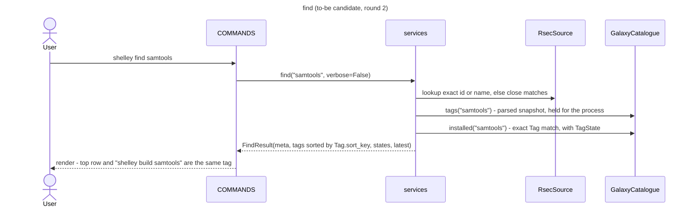
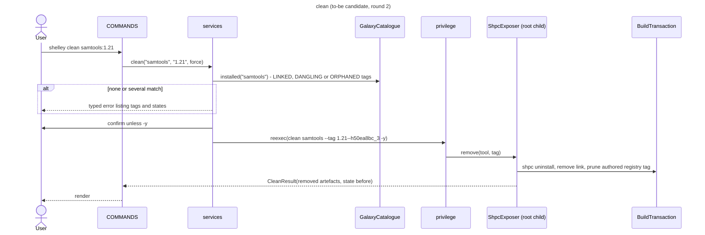
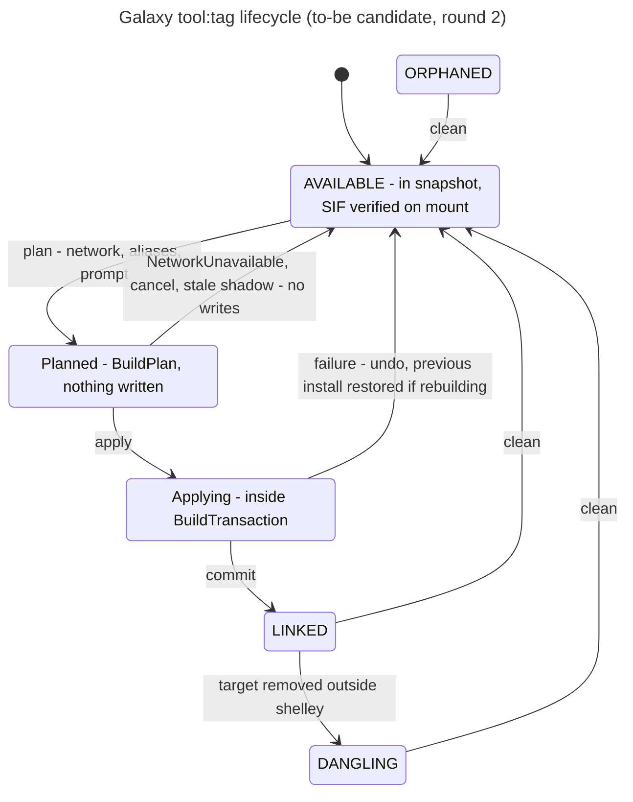

# Phase 5, round 2: refining Option C

Fred (2026-10-07) chose **Option C**, with **Option A as the recorded fallback**. This round shows only what changed since round 1.

## Diff summary since round 1

| # | Change | Why |
|---|---|---|
| R2-1 | **K5 message fixed to Fred's wording:** `Couldn't reach GitHub (raw.githubusercontent.com): <reason>. Try again in a few seconds.` `<reason>` comes from `net.diagnose`, e.g. "the request timed out after 10 s", "the name could not be resolved", "the proxy refused the connection" | Fred, Q2 of the round 1 checkpoint |
| R2-2 | **K8 becomes an admin step:** a new maintainer entry point, `shelley-registry-cleanup`. It is a dry run by default, and `--apply` needs root. `build` never deletes registry entries it did not create in this run | Fred, Q3 of the round 1 checkpoint |
| R2-3 | **The cleanup classifies entries by content, not by maintainer text:** an entry is *authored* if any tag is absent upstream, if its aliases differ from upstream, or if it has a marker directory. It is a *cache* only if identical to upstream. Anything that cannot be checked (offline) is left alone | `get_registry_tags` has no runtime caller, so pure caches come only from older versions; the dev VM's `star-fusion` entry looks like a cache by maintainer but is authored (tag `1.0.0` is not upstream) `[runtime]` |
| R2-4 | **`plan` detects a stale shadow:** if a local entry exists, lacks the requested tag, and the tag *is* upstream, `plan` stops with "A local registry entry for <tool> hides the upstream one; ask an admin to run `shelley-registry-cleanup`" | `[code]` shpc returns "the first occurrence of a module" by name (`shpc/main/registry/__init__.py:63-76`), then exits if the tag is missing from that entry (`shpc/main/modules/module.py:44-53`); it never falls through to upstream. So a stale local copy breaks builds of newer upstream tags today, too `[inferred]` |
| R2-5 | **Rebuilding an installed tag is now undoable (move-aside):** before `shpc install`, the tag's three shpc subtrees and its Lmod link are renamed aside; the undo moves them back, and `commit` deletes them | Round 1 left this open. It completes the T5 fix and prevents a failed rebuild from destroying a working module |
| R2-6 | **`TagState` enum** (`AVAILABLE`, `LINKED`, `DANGLING`, `ORPHANED`), computed by `GalaxyCatalogue.installed()` from what exists on disk; `clean` accepts any state except `AVAILABLE` | Proposes an answer to Q7 (orphans reachable by `clean`); an Enum rather than the State pattern, per the core |
| R2-7 | **Package layout and move map** fixed (below), keeping current package names where a module survives, to keep PR diffs readable (rank 6) | Rank 6 |
| R2-8 | **K7 tag value** is a fixed string, `local:keep-path`. shpc's schema only requires a string (`shpc/main/schemas.py:13-18`) | Q4 closed |
| R2-9 | `search` is unchanged in behaviour (Q6 deferred); the copied `search()` method is pulled up into `MetadataSource` | Duplicated Code; K1 constraint (Galaxy delivery unchanged) |

## Package layout and move map (to-be)

| To-be module | Contents | Comes from (as-is) | Fowler refactoring |
|---|---|---|---|
| `shelley/tags.py` | `Tag`, `latest()`, `conda_order()` | `cache._version_key`, `CVMFSModuleBuilder._parse_version`, `_sort_versions`, `_get_latest_version`, `split("--")` sites | Replace Primitive with Object; Combine Functions into Class |
| `shelley/_vendor/conda_version.py` | conda's `VersionOrder` (BSD-3-Clause notice kept) | new | — |
| `shelley/errors.py` | `NetworkUnavailable`, `MountUnavailable`, `TagNotFound`, `TagRequired`, `AmbiguousTag`, `StaleRegistryShadow` | `RuntimeError`/`ValueError` strings matched by regex (`build.py:195`) | Replace Error Code with Exception |
| `shelley/results.py` | `FindResult`, `BuildPlan`, `BuildResult`, `CleanResult`, `TagState` | report dicts and payload dicts (`find.py:112-121`, `cvmfs_builder.py:714-721`) | Replace Record with Data Class (Introduce Parameter Object) |
| `shelley/galaxy/catalogue.py` | `GalaxyCatalogue` | `utils/cache.py`; `CVMFSModuleBuilder._get_available_tools`, `list_versions`, `search_tool_version`; `find.module_is_installed`, `list_installed_versions` | Extract Class; Move Function |
| `shelley/galaxy/exposer.py` | `ShpcExposer` (`plan`, `apply`, `remove`) | `CVMFSModuleBuilder.shpc_install`, `_ensure_local_registry_entry`, `_share_build_artifacts`, `uninstall_module` | Extract Class; Split Phase (plan/apply) |
| `shelley/galaxy/registry.py` | `RegistryClient` (upstream fetch), `LocalRegistry` (authored entries, markers) | module-level registry functions in `cvmfs_builder.py` | Move Function |
| `shelley/builder/guts_integration.py` | unchanged except `extract_aliases` raises `NetworkUnavailable` instead of returning `[]` on clone failure | itself | — |
| `shelley/tools/shpc.py` | `Shpc` façade (`install`, `uninstall`, `module_base`) and the settings file | `_shpc_cmd`, `_run_shpc_*`, `builder/shpc_settings.py` | Move Function; Encapsulate external call |
| `shelley/tools/lmod.py` | `Lmod` façade (`load_build_modules`, `link`, `unlink`) | `utils/modules.py`, symlink code at `cvmfs_builder.py:572-578` | Move Function |
| `shelley/tools/net.py` | `fetch_text(url)`, `diagnose(url) -> Reachability` | `curl` calls in `cvmfs_builder.py`; `urlopen` in `update_check.py` | Substitute Algorithm (curl → urllib) |
| `shelley/transaction.py` | `BuildTransaction` | new | — |
| `shelley/privilege.py` | `needs_root`, `reexec` | `commands/build.py:25-82` | Move Function |
| `shelley/services.py` | `find`, `search`, `build`, `clean`, `build_many` → result dataclasses; no printing | logic in `commands/*.py`, `utils/batch.py` | Split Phase (logic vs rendering) |
| `shelley/client/commands.py` | `COMMANDS` table: parse, call a service, render; the CLI and REPL both loop over it | `client/cli.py`, `commands/interactive.py`, `utils/args.py`, `utils/commands.py` | Replace Conditional with a dispatch table |
| `shelley/client/render.py` | All result rendering | rendering in `commands/*.py`, `utils/render.py`, parts of `utils/style.py` | Move Function |
| `shelley/search/*` | Unchanged API; `search()` pulled up into the base class | itself | Pull Up Method |
| `utils/globals.py`, `utils/perms.py`, `utils/style.py`, `commands/update.py`, `utils/update_check.py` | Kept (they scored 2–3); Galaxy constants move to `galaxy/` | — | Move Field |
| *removed* | `CVMFSModuleBuilder`, `utils/cache.py`, `commands/{build,clean,find,search,interactive}.py`, `utils/batch.py`, `get_registry_tags`, `list_cvmfs_versions`, 4 unused `ShelleyStyle` methods | — | Remove Dead Code; Inline |

## Sequences changed since round 1

### find (to-be candidate)

### clean (to-be candidate)

The build sequence is as in round 1, plus R2-4 (stale-shadow check in `plan`) and R2-5 (move-aside inside `apply`).

## Lifecycle (to-be candidate)

`ORPHANED` can no longer be *entered* through shelley; it remains reachable by `clean` for leftovers created before this design and for out-of-band deletions.

## Traceability re-run (to-be modules, round 2)

Legend: ● serves · ○ partly · blank: not involved. Module keys: CMD `client/commands`+`render` · SVC `services` · PRV `privilege` · CAT `GalaxyCatalogue` · EXP `ShpcExposer` · REG `registry` · TAG `tags` · TX `transaction` · TLS `tools/{shpc,lmod,net}` · MDS `search/*` · UPD update · LAY `globals`+`perms` · ADM `shelley-registry-cleanup`.

| Driver | CMD | SVC | PRV | CAT | EXP | REG | TAG | TX | TLS | MDS | UPD | LAY | ADM |
|---|---|---|---|---|---|---|---|---|---|---|---|---|---|
| C1 search | ● | ● | | ● | | | | | | ● | | | |
| C2 find | ● | ● | | ● | | | ● | | | ● | | ● | |
| C3 build | ● | ● | ● | ● | ● | ● | ● | ● | ● | | | ● | |
| C4 build -i | ● | | | | ● | | | | | | | | |
| C5 batch | ● | ● | ○ | | | | | | | | | | |
| C6 clean | ● | ● | ● | ● | ● | ● | ● | ● | ● | | | ● | |
| C7 REPL | ● | | | | | | | | | | | | |
| C8 update | ● | | | | | | | | ○ | | ● | | |
| C9 shared layout | | | ● | | ● | | | | ● | | | ● | |
| C10 read-only without root | | ● | | ● | | | ● | | | ● | | | |
| T1 wrong version | | | | ● | | | ● | | | | | | |
| T2 orphans | | | | ● | ● | | | ● | | | | | |
| T3 test teardown | | | | | | | | ○ | | | | | |
| T4 prefix glob | | | | ● | | | ● | | | | | | |
| T5 cancelled -i | | | | | ● | | | ● | | | | | |
| T6 offline | | | | | ● | ● | | | ● | | | | |
| N1 network down | ● | | | | ● | ● | | | ● | | | | |
| N2 find = build | | ● | | ● | | | ● | | | | | | |
| K5 resource limits | | | | ● | ● | | | | | | | | |
| F7 discovery | | ○ | | | | | | | | ○ | | | |
| F1, F4, F5, PoC, E1 | | ○ | | | | | | | | | | | |
| K8 registry migration | | | | | ○ | ● | | | | | | | ● |

- **Drivers no module serves:** none in scope. F1, F4, F5, the PoC and E1 are latent (EESSI work in progress); `services` is where a second catalogue/exposer pair plugs in (○).
- **Modules no driver justifies:** none. `_vendor/conda_version.py` serves T1 through `tags`; `transaction` serves T2 and T5.
- **T3** is ○: `BuildTransaction` gives tests a single place to assert "nothing left behind"; teardown itself stays deprioritised.

## Test seams (input to Phase 8)

| Seam | Fake | Replaces today's |
|---|---|---|
| `GalaxyCatalogue(snapshot, mount, lmod_dir)` | a small JSON snapshot fixture plus a tmp mount tree of empty `tool:tag` files | patches of `Path.iterdir`/`stat` |
| `Shpc`, `Lmod` | `FakeShpc` recording argv and creating the expected dirs | `subprocess.run` patches |
| `RegistryClient`, `net` | `FakeRegistry(entries, reachable=False)` | `curl` patches |
| `BuildTransaction` | real (pure Python), asserted with failure injection at each step | none today |
| `services` | built with fakes; asserts on result dataclasses, not rendered text | console capture |

Contract tests: the same `GalaxyCatalogue` tests run against the fixture and, when marked `cvmfs`, against the live mount.

## New open questions

| # | Question | Proposed resolution |
|---|---|---|
| R2-Q1 | ~~Does shpc fall through to upstream when the local entry lacks the tag?~~ | **Answered from shpc source: no** (see R2-4). Pin it with one test against real shpc, marked `shpc` |
| R2-Q2 | Should the elevated child receive the resolved tag through a hidden flag (`--resolved-tag`) or a short-lived plan file? | Recommend the hidden flag: no new on-disk state |
| R2-Q3 | Q7: should `clean` accept `ORPHANED` tags (R2-6)? | **Decision for Fred** (recommended: yes) |

## Convergence check

| Criterion | Status |
|---|---|
| Every driver maps to at least one module | ✔ in scope; EESSI drivers latent by decision |
| No module lacks a justifying driver | ✔ |
| Every Phase 4 question answered or deferred | ✔ Q1–Q4, Q8, Q9 answered; Q5 (mount-unreachable behaviour, spike on a disposable VM) and Q6 (search join) deferred; Q7 is R2-Q3 |
| Every public interface testable without real CVMFS | ✔ via the seams above |
| Every class ≥ 2 on cohesion, encapsulation, testability | ✔ (`ShpcExposer` coh 2) |
| Every pattern passed the justification test | ✔ (round 1, K1–K8 and C) |
| Fred says it is done | pending |
